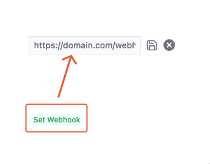

## 什么是 VoceChat 机器人

VoceChat 机器人本质是一个可以让你可编程控制的 VoceChat 账号，创建成功后，借助`API Key`可以便捷地向 VoceChat 发消息（频道和私聊都可以）。

## 什么是 Webhook

Webhook 依附于机器人而存在，是一个用以接收 VoceChat 推送数据的 URL 地址，可以这么理解：机器人负责把消息传送到 VoceChat，Webhook 则负责传出 VoceChat 消息到指定自定义 API。

## 创建机器人

:::tip
机器人管理入口只有管理账号才能看到
:::
由`设置 => 机器人&Webhook`进入机器人管理页面，点击`新增`按钮，弹窗中设置机器人姓名与 Webhook（选填），即可完成机器人的创建。


:::tip
创建成功后，可以在列表修改机器人头像
:::

## 初始化一个 API Key

:::tip
API Key 是机器人与 VoceChat 通信的凭证，请妥善保存，如有泄露或遗失，请及时删除，重新生成。
:::
给 API Key 起个名称，用以区分其他 API Key：

复制并妥善保存生成的 API Key：


## API Key 的使用

有了 API Key，就可以写自定义 API，利用创建的机器人，向 VoceChat 发消息了，目前开放了两个 API（均可在已部署的 API 文档内找到）：
:::tip
调用 API 时，均需要设置 header：`x-api-key`:`API Key`(此处请替换为自己的 API Key 值)
:::

### 向特定用户发消息，对应私聊场景

`/bot/send_to_user/{uid}`:`uid`为用户 ID，具体使用方式请参考自部署的 API 文档

### 向特定频道发消息，对应群聊场景

:::tip
特定频道必须是该机器人所在的频道
:::
`/bot/send_to_group/{gid}`:`gid`为频道 ID，具体使用方式请参考自部署的 API 文档

## 设置 Webhook

:::tip
Webhook 地址会预校验：`HTTP GET`请求响应`200`则通过校验。后续 VoceChat 会以`HTTP POST`方式向该地址推送聊天数据
:::



## Webhook 推送的数据类型

VoceChat 会实时向已设置的 Webhook 推送所有该机器人相关的消息数据，包括不限于：新消息，编辑消息，删除消息，回复消息，点赞等。下面分别举例：

### 新消息

有新消息时，会推送此数据：

```json
{
  "created_at": 1672048481664, //消息创建的时间戳
  "detail": {
    "content": "message", //消息内容
    "content_type": "text/plain", //消息类型，text/plain：纯文本消息，text/markdown：markdown消息，vocechat/file：文件类消息
    "expires_in": null, //消息过期时长，如果有数字，说明该消息是个限时消息
    "properties": null, //一些有关消息的元数据，比如如果是个图片消息，会有一些宽高，图片名称等元信息
    "type": "normal" //消息类型，normal代表是新消息
  },
  "from_uid": 7910, //来自于谁
  "mid": 2978, //消息ID
  "target": { "gid": 2 } //发送给谁，gid代表是发送给频道，uid代表是发送给个人
}
```

:::tip
以下的数据结构和上面的大同小异，只注释关键区别部分
:::

### 编辑消息

消息被编辑时，会推送此数据：

```json
{
  "created_at": 1672060767247,
  "detail": {
    "detail": {
      "content": "edit message",
      "content_type": "text/plain",
      "properties": null,
      "type": "edit" //具体的消息类型，edit代表是编辑消息
    },
    "mid": 2890,
    "type": "reaction" //初步的消息类型，reaction代表是针对消息的响应
  },
  "from_uid": 722,
  "mid": 2979,
  "target": { "uid": 13466 }
}
```

### 删除消息

消息被删除时，会推送此数据：

```json
{
  "created_at": 1672060943856,
  "detail": {
    "detail": {
      "type": "delete" //具体的消息类型，delete代表是删除消息
    },
    "mid": 2889, //被删除的消息ID
    "type": "reaction"
  },
  "from_uid": 722,
  "mid": 2980,
  "target": { "uid": 13466 }
}
```

### 回复消息

消息被回复时，会推送此数据：

```json
{
  "created_at": 1672061091917,
  "detail": {
    "content": "reply message",
    "content_type": "text/plain",
    "mid": 2858, //被回复的消息ID
    "properties": { "mentions": [] },
    "type": "reply" //具体的消息类型，reply代表是回复消息
  },
  "from_uid": 722,
  "mid": 2981,
  "target": { "uid": 13466 }
}
```

### 点赞

消息被点赞时，会推送此数据：

```json
{
  "created_at": 1672061213196,
  "detail": {
    "detail": {
      "action": "👍", //具体的点赞内容，是个emoji字符
      "type": "like" //具体的消息类型，like代表是点赞消息
    },
    "mid": 2881, //被点赞的消息ID
    "type": "reaction"
  },
  "from_uid": 722,
  "mid": 2982,
  "target": { "uid": 13466 }
}
```
