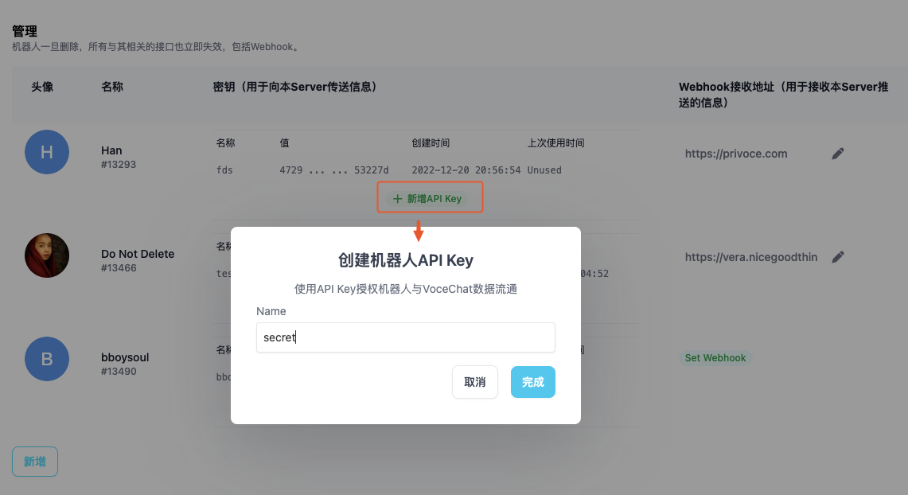
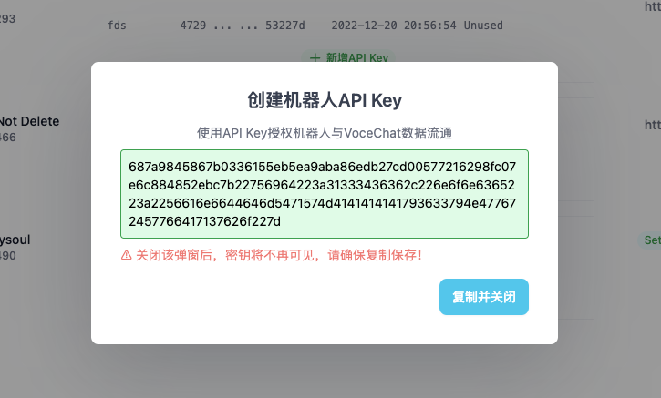

## Bot, the future of interactions

Bot is the new app. Any feature that can be delivered through a bot will eventually become a bot, e.g., newsletter, newsfeed, contact us, your home device controlling system, virtual partner, etc. Morevoer, agent bot will be able to let different bots collaborate with each other. VoceChat bot + webhook aims to help developers to develop and publish bots as convenient as possible. Here are some bots build by VoceChat users.

import InlineImages from "@site/src/components/InlineImages";

<InlineImages
  images={[
    {
      src: "https://github.com/Privoce/vocechat-doc/assets/12148615/ca256b17-e7b7-456d-a9c6-a3646d726da1",
      title: "backgroundremovalbot",
    },
    {
      src: "https://github.com/Privoce/vocechat-doc/assets/12148615/63e33b83-7f0d-4129-988f-a70e0cda16c2",
      title: "gptbot",
    },
  ]}
/>

Try the bots above at [SilenceChat](https://chat.silencetime.com/) built by our friend Oliver, website：[https://ai.silencetime.com/](https://ai.silencetime.com/)

## What is a VoceChat Bot User

VoceChat bot user can be created by the server admin and used to send messages to a designated member or channel. After creation, there will be an `API Key`which is required when you send a message (the messaging process is explained in detail below).

## What is VoceChat's Webhook

VoceChat's webhook is used to received messages. Each webhook is linked to a bot, and the webhook URL should be provided by the server admin to receive the data received by this very bot user.

## Create a Bot

:::tip
Only server admins can create bots.
:::
Go to `Settings => Bot&Webhook`, click `new`, set bot name and webhook url (optional).


:::tip
You can change the profile of the bot as well.
:::

## Create an API Key

:::tip
API Key is used for the bot to send message to VoceChat, please save it privately. If you have losed or exposed it, don't hesitate to delete the old key and create a new one.
:::
You can also name an API Key to distinguish its usage from other API keys：

Copy the API Key：


## How to use API key

:::tip
All the messaging related API can be found at the [API doc](/api-doc),
:::

After gettnig the API Key, you can send messages to a user or a channel:
:::warning Attention
When sending messages, you should set the http header：`x-api-key`:`xxxxxxxxxxxxxxxxxx`(change to your API key's real value)
:::

### Types of Messages

VoceChat has three supported messages types：**Text**，**Markdown**和**Files**.

#### Text

- http header: `content-type: text/plain`
- body: `just pure text message like this`

#### Markdown

- http header: `content-type: text/markdown`
- body: `**this is an exmaple markdown bolded message**`

#### Files(Images, Vidoes, etc.)

- http header: `content-type: vocechat/file`
- body:
  ```json
  {
    "path": "string"
  }
#### Email(Set up SMTP first, then the bot will send email for you through this API)

- http header: `content-type: application/json`
- body:
  ```json
  {
    "to":"youremail@gmail.com",
    "subject":"test title",
    "content":"test content"
  }
  ```

**Files need to be uploaded first using this API👇🏻, then you can use the uploaded file path as shown above**

### Send welcome message to a new user
The webhook you set will receive a message "newuser" when a user has signed up to the server where the bot resides. Then you can personalize a welcome message sending to the new user.

### Send message to a user

API：`/api/bot/send_to_user/{uid}`，`uid`is the user ID. You can get the user ID on the web front end when chatting with the user (the URL will have the user ID).

E.g.: send a text message `hello` the to user with `uid:1`. The http request should be like this (you have to adapt this to the programming language of your own):

```
POST /api/bot/send_to_user/1
content-type: text/plain
x-api-key: xxxxxxxxxx

hello
```

E.g.: send a markdown message `hello` to the user with `uid:1`. The http request should be like this (you have to adapt this to the programming language of your own):

```
POST /api/bot/send_to_user/1
content-type: text/markdown
x-api-key: xxxxxxxxxx

**hello**
```

For more details, see [API doc](/api-doc).

### Send message to a channel

:::tip
Add the bot to the channel you want to send message to first!
:::
API：`/api/bot/send_to_group/{gid}`，`gid`is the channel ID. You can get the channel ID on the web front end when chatting in the channel (the URL will have the channel ID).

E.g.: send a text message `hello` to the channel with `gid:1` , the http request should be like this (you have to adapt this to the programming language of your own):

```
POST /api/bot/send_to_group/1
content-type: text/plain
x-api-key: xxxxxxxxxx

hello
```

E.g.: send a markdown message `hello` to the channel with `gid:1` , the http request should be like this (you have to adapt this to the programming language of your own):

```
POST /api/bot/send_to_group/1
content-type: text/markdown
x-api-key: xxxxxxxxxx

**hello**
```

For more details, see [API doc](/api-doc).

### Other related APIs

- `/api/bot/file/upload`：File uploading API. Used before sending files.
- `/api/bot`：Get all channels the bot is in.
- `/api/bot/user/{uid}`：Get info of a user.
- `/api/bot/group/{gid}`：Get info of a group.

## Webhook Settings

:::warning Important!
Webhook URL should be a valid one whose `HTTP GET`response should be `200`. The messages will send through `HTTP POST` to this URL.
:::


## Webhook Messages Types.

VoceChat will send messages to webhooks including:

- **New Message**
- **Edit of a Message**
- **Deletion of a Message**
- **Reply of a Message**
<!-- - **Like of a Message** -->

Here are how the messages look like：

### New Message

```json
{
  "created_at": 1672048481664, //timestamp of when the message is created
  "detail": {
    "content": "hello this is my message to you", //content of the essage
    "content_type": "text/plain", //content type, three of them: text/plain, text/markdown, vocechat/file
    "expires_in": null, //When will this message disappear: if there is a non-zero number "x", then this message will disappear (get deleted) in x seconds.
    "properties": null, //mentions a person; image metadata.
    "type": "normal" //types of messages, normal means new message. Other types include edit, deletion, reply, like.
  },
  "from_uid": 7910, //from which user
  "mid": 2978, //message ID
  "target": { "gid": 2 } //to which user or channel, gid means the message is sent to a channel with this gid, uid means the message is sent to a user with this uid.
}
```

:::tip
The message types below are less used--you can see for "deletion", "edit" and "like", there is an extra type parameter with the value "reaction", which means those are actions upon another message.
:::

### Edit

When a messaged is edited, the webhook will receive this:

```json
{
  "created_at": 1672060767247,
  "detail": {
    "detail": {
      "content": "hello I'm editing this message lol",
      "content_type": "text/plain",
      "properties": null,
      "type": "edit"
    },
    "mid": 2890, //this is the id of the message that will be replaced
    "type": "reaction"
  },
  "from_uid": 722,
  "mid": 2979,
  "target": { "uid": 13466 }
}
```

### Deletion

When a messaged is deleted, the webhook will receive this:

```json
{
  "created_at": 1672060943856,
  "detail": {
    "detail": {
      "type": "delete"
    },
    "mid": 2889, //the message ID
    "type": "reaction"
  },
  "from_uid": 722,
  "mid": 2980,
  "target": { "uid": 13466 }
}
```

### Reply

When a messaged is a reply message, the webhook will receive this:

```json
{
  "created_at": 1672061091917,
  "detail": {
    "content": "I want to reply to a message",
    "content_type": "text/plain",
    "mid": 2858, //the ID of the message that is being replied to
    "properties": { "mentions": [] },
    "type": "reply"
  },
  "from_uid": 722,
  "mid": 2981,
  "target": { "uid": 13466 }
}
```

<!-- ### Like

When a messaged is liked, the webhook will receive this:

```json
{
  "created_at": 1672061213196,
  "detail": {
    "detail": {
      "action": "👍", //the emoji used
      "type": "like"
    },
    "mid": 2881, //the ID of the message being liked
    "type": "reaction"
  },
  "from_uid": 722,
  "mid": 2982,
  "target": { "uid": 13466 }
}
``` -->

There are two "type" parameters, the first one refers to the message type, and the second one refers to whether the new message is an action upon an another (older) message.


### Custom Encryption for Robot Messages
The set and get interfaces for the secret are optional; if not set, messages are transmitted in plaintext.
To set secret, you need to define a 16-byte length string. The backend will then automatically encrypt it using AES. After the webhook receives a message, it needs to be decrypted with AES and then unpadded with PKCS7 to retrieve the original JSON.
