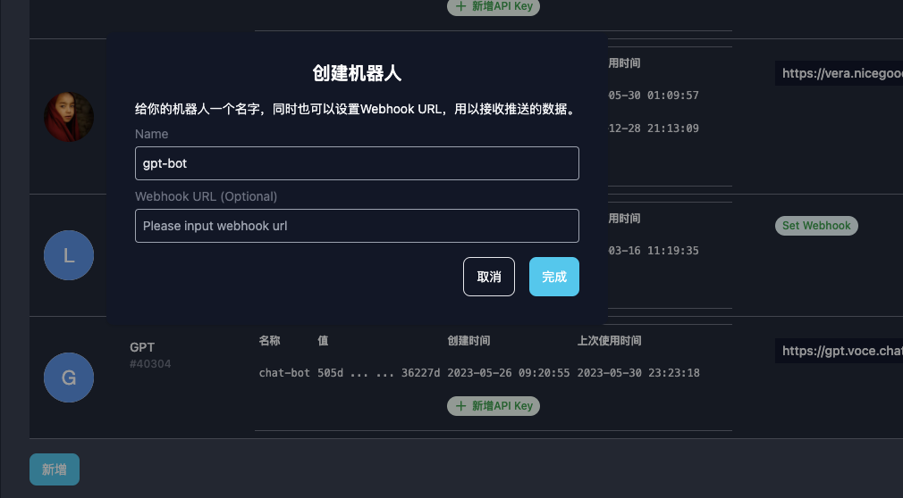

## Prerequisite

- OpenAI API Key
- A running VoceChat server

## Creat a new VoceChat bot at Bot&Webhook page

- Ignore the webhook entry for now (we will get back to this at the end)
- We will use the Bot ID so mark it down

## Take Vercel as an hosting example, you can also host your GPT bot backend somewhere else.

See steps: https://github.com/Privoce/vocechat-chatbot-ui#readme

Set env variables:

| env              | description                                                                                                                               |
| --------------------------------- | ----------------------------------------------------------------------------------------------------------------------------------------- |
| VOCECHAT_ORIGIN        | Vocechat API address, often times the same as your vocechat url, e.g., https://vocechat.example.com                                                                                   |
| VOCECHAT_BOT_ID        | Vocechat bot ID, see it at your bot page, it's the number after the hashtag #                                                                                   |
| VOCECHAT_BOT_SECRET        | Vocechat bot API Key, used for Vocechat auth.                                                                                |
| OPENAI_API_KEY        | For OpenAI API call  | 

## Fill out webhook

After hosting your backend successfully, now you have a GPT bot API address, supposedly it is: mygpt.vercel.com, then the webhook should be：https://mygpt.vercel.com/api/bot. Fill this out at your bot&webhook section.

## Ready!

Let's at(@) the bot at a channel or send it a DM!

