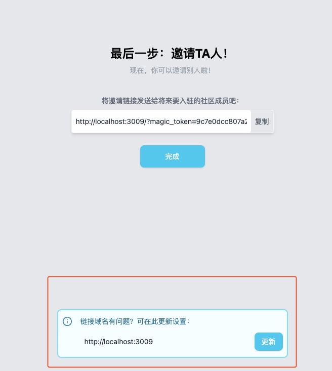
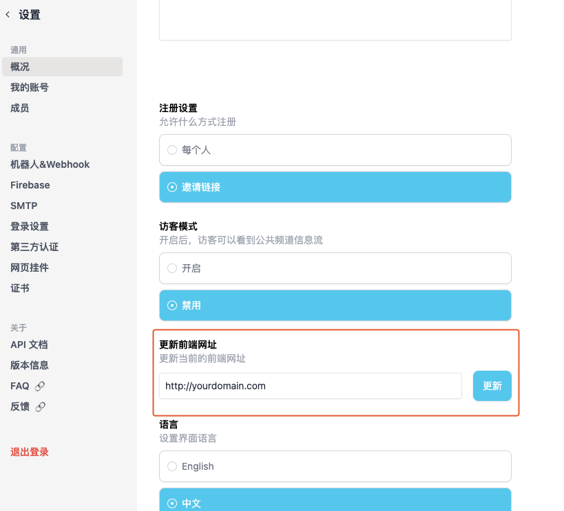

## Is VoceChat Free？

VoceChat has a free tier for community server no more than **20** members. You need to purchase a license if your server is larger than 20 members.

## Is there a backdoor?

VoceChat has no backdoor, no data collection, everything is hosted on your own server, even the license mechanism is based on RSA and runs locally.

## Can't receive notification?

We have a default official setting of the Firebase, which is used to send notification. If Google service cannot be reached by your server or device, then you may not receive notification as expected.

## 我的邀请链接域名异常 {#fe_url}

由于VoceChat无法提前自动获取前端访问地址，所以需要手动设置前端域名，如果你未设置前端访问地址，邀请链接的域名默认将是个无意义的IP地址：`1.2.3.4`，该域名可自行更新，设置入口有多处：

- 在部署时可以通过参数 `--frontend_url`传参设置
- 部署成功，首次初始化时，可以在邀请环节手动设置

- 部署成功，正常访问后，使用管理员账号，可以在设置页手动设置



## How to send files with VoceChat API？

VoceChat sending files requires uploading the file(s) first:

:::tip Tip
Check [swagger](/api-doc) to see the API details, also, all API involved requires the user's session token to be passed through header: `x-api-key`.
:::

### First step: prepare

API：`/resource/file/prepare`。
This will POST two parameters：
- `content_type`: should stay the same as in the http header: `content-type`. More infr: [MIME](https://developer.mozilla.org/en-US/docs/Web/HTTP/Basics_of_HTTP/MIME_types)
- `filename`: filename and the extension, e.g., file.txt, abc.png.

A `file_id` will be generated which will be used later.

### Second step：upload
API：`/resource/file/upload`.
This API supports chunck uploading (optional), if used（recommended chunck size is 200KB), you need to call this several times, each call will POST the following:

- `file_id`: the last step's `file_id`
- `chunk_data`: the file chunck
- `chunk_is_last`: whether this is the last chunck


:::tip 注意
If you want to upload a whole file together, set chunk_data to the whole file, and set chunk_is_last to be true, then you can upload the file all at once.
:::

When the last chunck is uploaded, you will receive:
``` json
{
  "path": "string",
  "size": 0,
  "hash": "string",
  "image_properties": {
    "width": 0,
    "height": 0
  }
}
```
We need to use this `path` in the next step!

### Third step：send file message

Here is an example to send this file to a user:

API：`/user/{uid}/send`
- Set header: `content-type:vocechat/file`
- The `uid` should be the receiver's uid (see it at the front end url)
- POST
  ``` json
  {
    "path": "string"
  }
  ```
  This `path` is the `path` you received in the second step.

## After installing and onboarding, there is always a loading sign.

Make sure your server API has no CDN, you have to make sure `/api` has no CDN.
