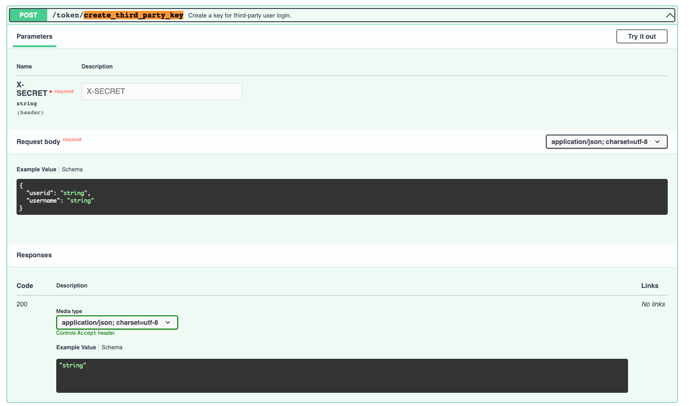

If you already have an ID system on your app and want to connet it ot VoceChat, check this out!

:::tip
May take around 1h of coding.
:::

## Have a running VoceChat app first

You should have VoceChat run somewhere, e.g., `https://vocechat.yourdomain.com/`. You need to be an **Admin** of this VoceChat server.

### Get API token

Visit: `https://vocechat.yourdomain.com/#/setting?nav=api`

### Use VoceChat API

After having the API token ready, use VoceChat server API to create the login token for users.

:::tip Attention
In the API doc `https://vocechat.yourdomain.com/api/swagger`, the API we have used is:`/token/create_third_party_key`. We pass the API token through `header`, and inside `body`, you need to fill in the user ID by yourself (`userid`) and username (`username`) by yourself as well. The API token has an expiration limit of 2 minites and can be renewed by calling again. We recommend you to get a new API token whenever there is a sign in action.
:::

### Sign in

After getting the sign in token, append it to your VoceChat website path like this `https://vocechat.yourdomain.com/#/oauth/[token]`, this URL is the sign in URL to VoceChat for your user.
