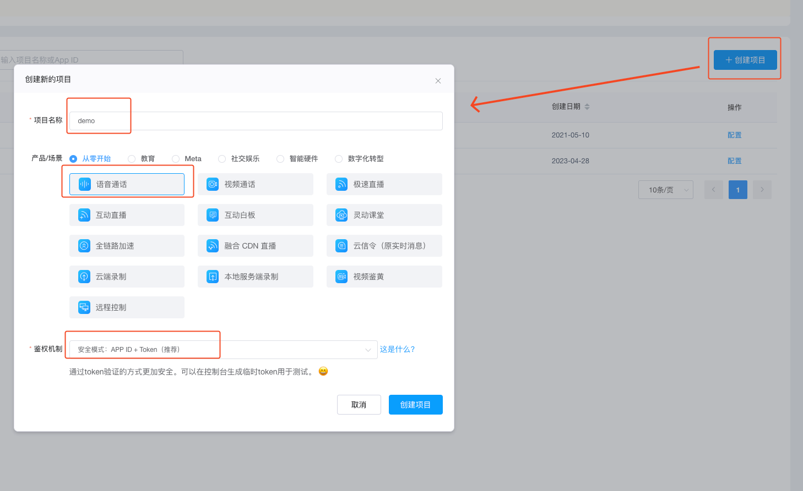
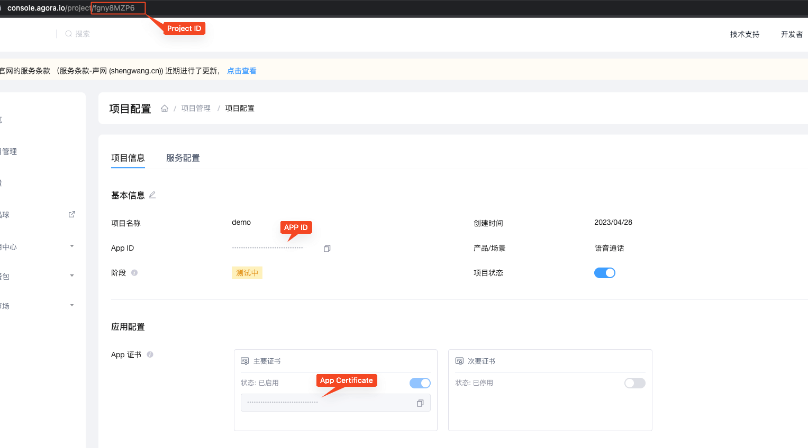
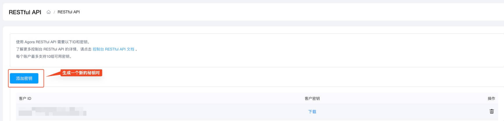
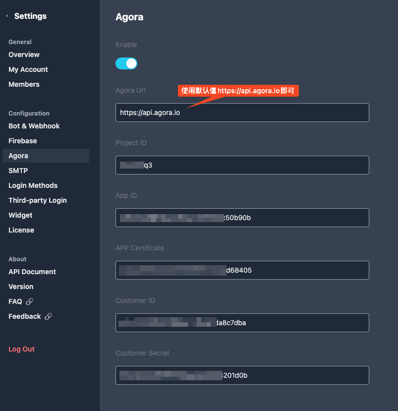
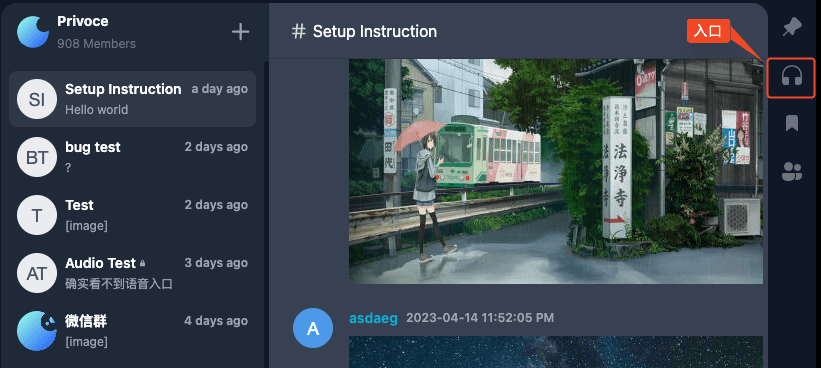

VoceChat音视频通话功能是基于Agora开发，所以只需配置下Agora，即可实现音视频通话。

## 准备工作：

- Agora注册账号
- 完成Agora实名认证（否则功能受限）
- 创建一个语音通话的项目（https://console.agora.io/projects）

## 第一步：在Agora后台获取Agora项目的配置信息

进入项目设置页面，找到我们需要的配置信息:

> Project ID 从网址获取，比如：https://console.agora.io/project/xxx 则Project ID为：xxx

在 https://console.agora.io/restfulApi 页面，生成秘钥对（Customer ID & Customer Secret）：

## 第二步：在VoceChat配置Agora

进入VoceChat设置页面，在左侧导航找到Agora配置：

将第一步收集到的信息，填入对应的配置项中，刷新页面，即完成了音视频通话的初始化。

## 音视频通话的使用入口

入口在每个channel消息流最右侧的耳机小图标

## 注意

- agora有免费音视频使用额度（以分钟计算），超出部分会产生一定费用，具体值请以官方为准
- 除了音视频通话，VoceChat还支持屏幕分享功能
- 一对一私聊音视频通话还在开发中，暂不支持，如有需求，可以新建只有两个人的私有Channel来替代