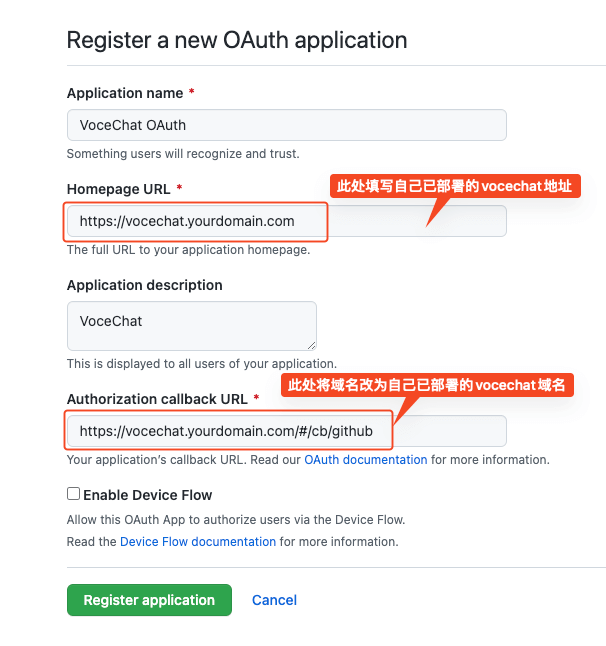
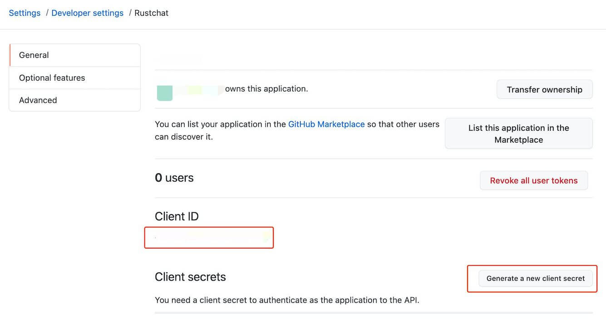

# How to set up Github Login

The steps of enabling Github Login are as follows:

:::tip
GitHub account required
:::

## Login to https://github.com/ ,

## Access the URL below, and complete the required form:

[https://github.com/settings/applications/new](https://github.com/settings/applications/new)

:::tip
GitHub OAuth callback URI:`https://vocechat.yourdomain.com/github/cb`, only replace the domain with your VoceChat domain.
:::

## get ClientID, ClientSecret:

## 3. Fill the clientID and ClientSecret into the VoceChat settings:

