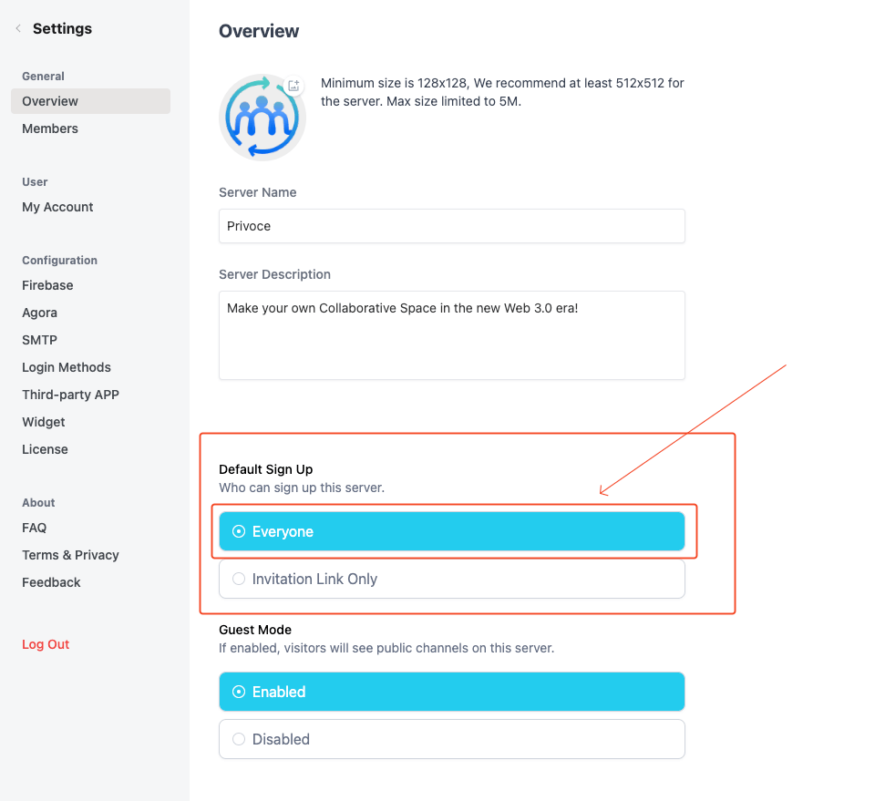
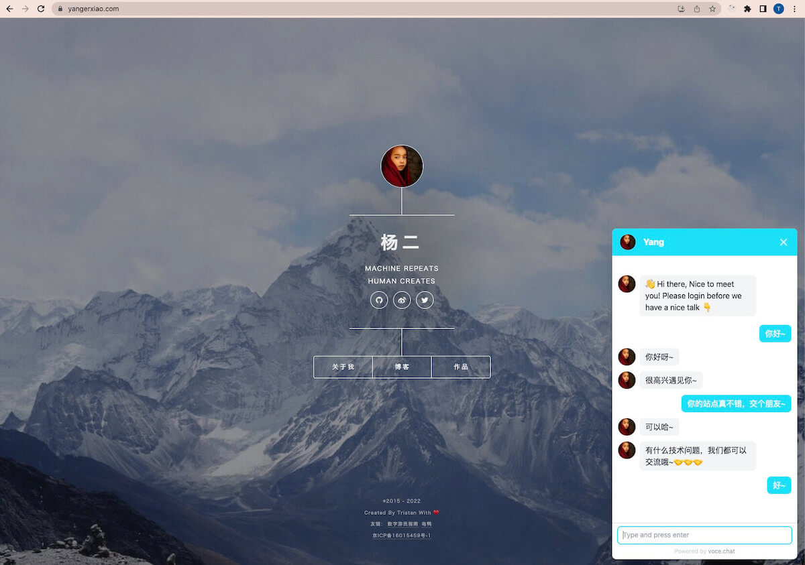
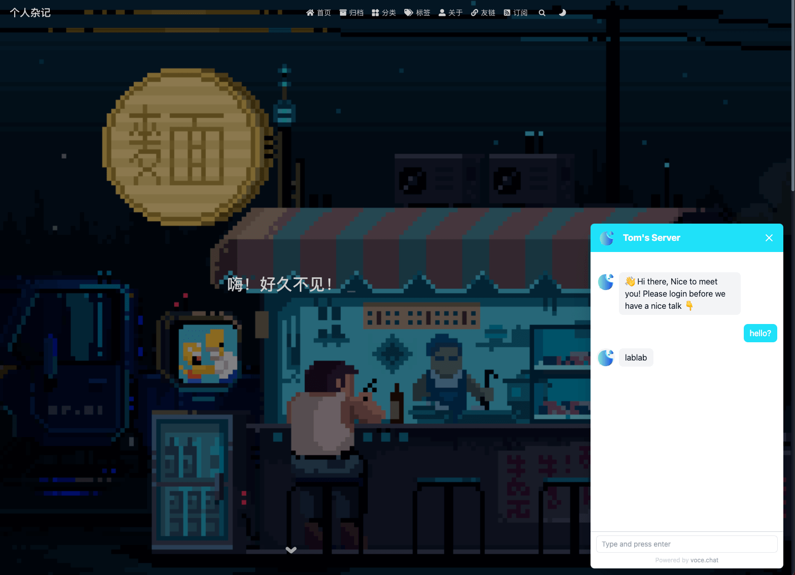

## Before you use chat widget

You should have met these prerequisites:

- Have a vocechat server (host your own vocechat server:[host VoceChat](/install)）
- Logged in to your vocechat server.
- Enalbe everyone to join the server (Setting --> Overview)
  
- Enable 3rd party login
  - [Google Login Setup](/setting/third_login/login-google)
  - [Github Login Setup](/setting/third_login/login-github)

## Now you can use chat widget:

Take this as an example`https://vocechat.yourdomain.com`:

```html
<!-- embed this code snippet to your html body -->
<script
  data-host-id="1"
  data-auto-reg="true"
  data-login-token=""
  data-close-width="52"
  data-close-height="52"
  data-open-width="380"
  data-open-height="680"
  src="https://vocechat.yourdomain.com/widget.js"
  async
/>
```

Explanation of the code above:

<table >
<thead >
  <tr><th scope="col">Name</th><th scope="col"  >Default Value</th><th scope="col"  >What's this for</th></tr>
</thead>
<tbody>
 <tr ><td >id</td><td >""</td><td >custom widget id for registering user</td></tr>
  <tr ><td >host-id</td><td >1</td><td >The user (id=1 means the first user) that the guest will chat with</td></tr>
  <tr ><td >auto-reg</td><td >true</td><td >true: visitor auto register and start chat, false: need input email</td></tr>
  <tr ><td >login-token</td><td >""</td><td >The login token generated by yourself's account, for more details, please refer to: [Login in with other account](/login-with-other-account).</td></tr>
  <tr ><td >close-width</td><td >52(px)</td><td >Chat icon floater width</td></tr>
  <tr ><td >close-height</td><td >52(px)</td><td >Chat icon floater height</td></tr>
  <tr ><td >open-width</td><td >380(px)</td><td >Chat widget width</td></tr>
  <tr ><td >open-height</td><td >680(px)</td><td >Chat widget height</td></tr>
</tbody>
</table>

## Use VoceChat widget for "Contact me" example

### https://yangerxiao.com

- vocechat: https://vocechat.yangerxiao.com/
- vocechat widget: https://yangerxiao.com/
  

### https://vc.moduoyu.com/

- vocechat: https://vc.moduoyu.com/
- vocechat widget: https://laoona.com/
  

### https://vocechat.tomzhu.site/

- vocechat: https://vocechat.tomzhu.site/
- vocechat widget: https://tomzhu.site/
  

👏🏻👏🏻👏🏻
Try our chat widget: https://voce.chat and send your example (website url) to us to win a $120 coupon!
