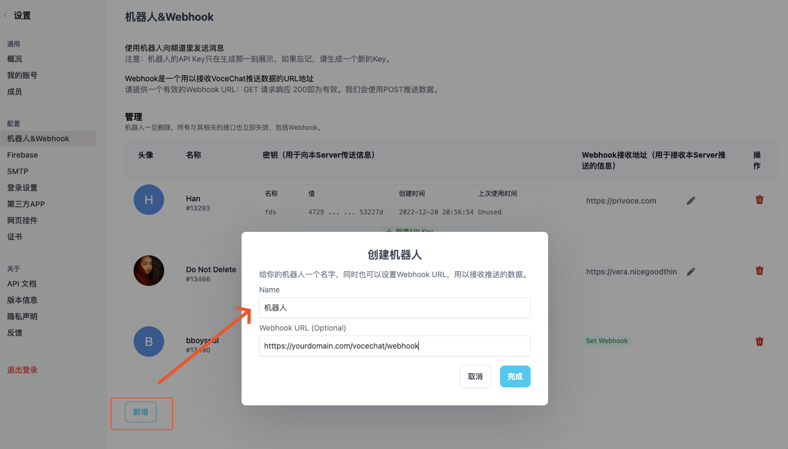
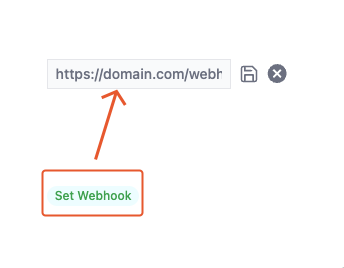

import Tabs from '@theme/Tabs';
import TabItem from '@theme/TabItem';

## 机器人：互联网的未来

机器人（Bot）是新一代的互联网应用（App），我们可以用熟悉的对话聊天方式与机器人交互，机器人的玩法随着技术的成熟愈发多样，如“修图”，“查询数据”，“客服（自动回复）”，“控制智能家电”，“AI伴侣”，“收费”等。VoceChat的机器人与Webhook方便了机器人的开发与使用。下面是几个用户利用VoceChat开发的机器人例子：
 


以上案例均来自[SilenceChat](https://chat.silencetime.com/), 官网：[https://ai.silencetime.com/](https://ai.silencetime.com/)


## 什么是 VoceChat 机器人

VoceChat 机器人本质是一个可以让你可编程控制的 VoceChat 账号，创建成功后，借助`API Key`可以便捷地向 VoceChat 发消息（频道和私聊都可以）。

## 什么是 Webhook

Webhook 依附于机器人而存在，是一个用以接收 VoceChat 推送数据的 URL 地址，可以这么理解：机器人负责把消息传送到 VoceChat，Webhook 则负责传出 VoceChat 消息到指定自定义 API。

## 创建机器人

:::tip
机器人管理入口只有管理账号才能看到
:::
由`设置 => 机器人&Webhook`进入机器人管理页面，点击`新增`按钮，弹窗中设置机器人姓名与 Webhook（选填），即可完成机器人的创建。



:::tip
创建成功后，可以在列表修改机器人头像
:::

## 初始化一个 API Key

:::tip
API Key 是机器人与 VoceChat 通信的凭证，请妥善保存，如有泄露或遗失，请及时删除，重新生成。
:::
给 API Key 起个名称，用以区分其他 API Key：

复制并妥善保存生成的 API Key：


## API Key 的使用

:::tip
以下提到的所有 API 均可在[已部署的 API 文档](/api-doc)内找到，
:::

有了 API Key，就可以通过自定义 API，借助机器人向 VoceChat 发消息了，目前开放了两个 API（均可在已部署的 API 文档内找到）：
:::warning 重要提示
调用机器人相关 API 时，均须设置 http header：`x-api-key`:`API Key`（此处请替换为自己的 API Key 值）
:::

### 消息类型介绍

VoceChat 目前定义了三种消息类型：**文本消息**，**Markdown 消息**和**文件消息**。它们有各自的数据结构和注意点。

#### 文本消息

- http header: `content-type: text/plain`
- body: 纯文本，例如：`message`

#### Markdown 消息

- http header: `content-type: text/markdown`
- body: Markdown 源码，例如：`**bold**`

#### 文件消息（图片，音视频，文档等）

- http header: `content-type: vocechat/file`
- body:

  ```json
  {
    "path": "string"
  }
  ```

:::tip 
文件消息比较特殊，需要先调用上传文件的 API，使用上传成功拿到的资源 path 填充到 body 里，然后当做消息发出去，具体流程，请参阅[常见问题：如何发送文件消息](/faq#file_msg)
:::

### 向特定用户发消息，对应私聊场景

API：`/api/bot/send_to_user/{uid}`，`uid`为用户 ID

HTTP请求举例：向`uid:1`发送纯文本消息：`hello`，http 请求结构（此处只列举出关键描述）：

```
POST https://replace.yours.domain/api/bot/send_to_user/1
content-type: text/plain
x-api-key: xxxxxxxxxxxx

hello
```

具体编程语言举例：
:::tip 温馨提示
无论哪种编程语言，本质上都是为了构建上面举例的HTTP请求
:::
<Tabs groupId="langs">
  <TabItem value="js" label="Node.js" default>

   ```js
    //我们使用最常用的axios发请求，向uid为1的用户发送纯文本消息：hello
    import axios from 'axios';

    axios.post(`https://replace.your.domain/api/bot/send_to_user/1`,`hello`,{
      headers:{
        // highlight-next-line
        'content-type':"text/plain",
        'x-api-key':"xxxxxxxxxxxx"
      }
    }).then(resp=>{
      console.log("发送成功，消息ID：",resp.data)
    }).catch(err=>{
      console.error("发送失败：",err.message)
    })
   ```

  </TabItem>
  <TabItem value="java" label="Java">

      coming soon

  </TabItem>
  <TabItem value="php" label="PHP">

      coming soon

  </TabItem>
  
</Tabs>

HTTP请求举例：向`uid:1`发送 markdown 消息：加粗的`hello`，http 请求结构（此处只列举出关键描述）：

```
POST /api/bot/send_to_user/1
content-type: text/markdown
x-api-key: xxxxxxxxxxxx

**hello**
```

具体编程语言举例：

<Tabs groupId="langs">
  <TabItem value="js" label="Node.js" default>

   ```js
    //我们使用最常用的axios发请求，向uid为1的用户发送markdown消息：加粗的hello
    import axios from 'axios';

    axios.post(`https://replace.your.domain/api/bot/send_to_user/1`,`**hello**`,{
      headers:{
        // highlight-next-line
        'content-type':"text/markdown",
        'x-api-key':"xxxxxxxxxxxx"
      }
    }).then(resp=>{
      console.log("发送成功，消息ID：",resp.data)
    }).catch(err=>{
      console.error("发送失败：",err.message)
    })
   ```

  </TabItem>
  <TabItem value="java" label="Java">

      coming soon

  </TabItem>
  <TabItem value="php" label="PHP">

      coming soon

  </TabItem>
  
</Tabs>
具体使用方式请参考自部署的 API 文档

### 向特定频道发消息，对应群聊场景

:::tip
特定频道必须是该机器人所在的频道
:::
API：`/api/bot/send_to_group/{gid}`，`gid`为频道 ID，使用方式和私聊场景大同小异，只是在 API PATH 上有区别，其他一样。

### 回复特定消息

API：`/api/bot/reply/{mid}`，`mid`为被回复的消息ID，使用方式和私聊场景大同小异，只是在 API PATH 上有区别，其他一样。

### 其他相关 API

- `/api/bot`：获取与机器人相关的所有频道列表
- `/api/bot/file/prepare`：上传文件前的准备 API，其返回值在后续调用上传API的时候会用到
- `/api/bot/file/upload`：上传文件 API，用于后续发送文件类消息
- `/api/bot/user/{uid}`：获取具体的用户信息
- `/api/bot/user/{uid}`：获取具体的用户信息
- `/api/bot/group/{gid}`：获取具体的频道信息

:::tip
机器人文件上传相关API的使用，请参考[FAQ](/faq#file_msg)
:::

## 设置 Webhook

:::warning 重要提示
Webhook 地址会预校验：`HTTP GET`请求响应状态码`200`则通过校验。后续 VoceChat 会以`HTTP POST`方式向该地址推送聊天数据，注意：推送接收到，请务必给出`HTTP STATUS 200`的响应，否则会当做推送失败处理，会重复推送。
:::



## Webhook 推送的数据类型

VoceChat 会实时向已设置的 Webhook 推送所有该机器人相关的消息数据，包括不限于：

- **新消息**
- **编辑消息**
- **删除消息**
- **回复消息**

下面分别举例：

### 新消息

有新消息时，会推送此数据：

```json
{
  "created_at": 1672048481664, //消息创建的时间戳
  "detail": {
    "content": "hello this is my message to you", //消息内容
    "content_type": "text/plain", //消息类型，text/plain：纯文本消息，text/markdown：markdown消息，vocechat/file：文件类消息
    "expires_in": null, //消息过期时长，如果有大于0数字，说明该消息是个限时消息
    "properties": null, //一些有关消息的元数据，比如at信息，文件消息的具体类型信息，如果是个图片消息，还会有一些宽高，图片名称等元信息
    "type": "normal" //消息类型，normal代表是新消息
  },
  "from_uid": 7910, //来自于谁
  "mid": 2978, //消息ID
  "target": { "gid": 2 } //发送给谁，gid代表是发送给频道，uid代表是发送给个人，此时的数据结构举例：{"uid":1}
}
```

#### 文件消息

消息类型 `text/plain`和`text/markdown`同归属于文本消息，数据结构比较简单明了，无需赘述。在此特别说明下`vocechat/file`文件消息：

```json
{
  "created_at": 1672048481664, 
  "detail": {
    "content": "2023/1/26/cbb7ba67-10d8-4aad-b7c3-b8a7b3ecfc15", //资源的file_path
    "content_type": "vocechat/file", //消息类型，text/plain：纯文本消息，text/markdown：markdown消息，vocechat/file：文件类消息
    "expires_in": null, 
    "properties": {content_type:"image/png",height:332,width:445,name:"xxx.png",size:234235},//有关该文件的元信息 
    "type": "normal"
  },
  "from_uid": 7910, 
  "mid": 2978, 
  "target": { "gid": 2 }
}
```

- 此时`content`字段值，是指资源的`file_path`，需做一次转换，才能拿到完整的资源地址，转换规则：`{PROTOCOL}://{SERVER_HOST}/api/resource/file?file_path={encodeURI(content)}`
  - `PROTOCOL`:`http` 或者 `https`，根据自己部署实例的实际情况而定
  - `SERVER_HOST`即自己部署实例的主机名（如有特殊端口号，比如`3000`，不要忘记加上）
  - `file_path`参数需要做一次URI转义
- `properties`有具体的文件类型信息，以及其它一些元信息，比如文件名，文件大小，如果是个图片消息，还会有一些宽高等

:::tip
以下的数据结构和上面的大同小异，只注释关键区别部分
:::

### 编辑消息

消息被编辑时，会推送此数据：

```json
{
  "created_at": 1672060767247,
  "detail": {
    "detail": {
      "content": "hello I'm editing this message lol",
      "content_type": "text/plain",
      "properties": null,
      "type": "edit" //二级消息类型，edit代表是编辑消息
    },
    "mid": 2890,
    "type": "reaction" //一级消息类型，reaction代表是针对消息的响应
  },
  "from_uid": 722,
  "mid": 2979,
  "target": { "uid": 13466 }
}
```

### 删除消息

消息被删除时，会推送此数据：

```json
{
  "created_at": 1672060943856,
  "detail": {
    "detail": {
      "type": "delete" //二级消息类型，delete代表是删除消息
    },
    "mid": 2889, //被删除的消息ID
    "type": "reaction"
  },
  "from_uid": 722,
  "mid": 2980,
  "target": { "uid": 13466 }
}
```

### 回复消息

消息被回复时，会推送此数据：

```json
{
  "created_at": 1672061091917,
  "detail": {
    "content": "I want to reply to a message",
    "content_type": "text/plain",
    "mid": 2858, //被回复的消息ID
    "properties": { "mentions": [] },
    "type": "reply" //二级消息类型，reply代表是回复消息
  },
  "from_uid": 722,
  "mid": 2981,
  "target": { "uid": 13466 }
}
```
