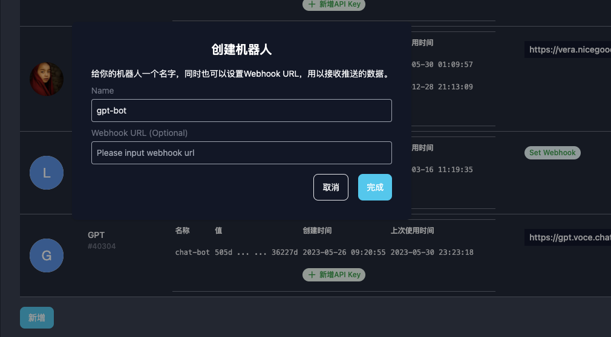
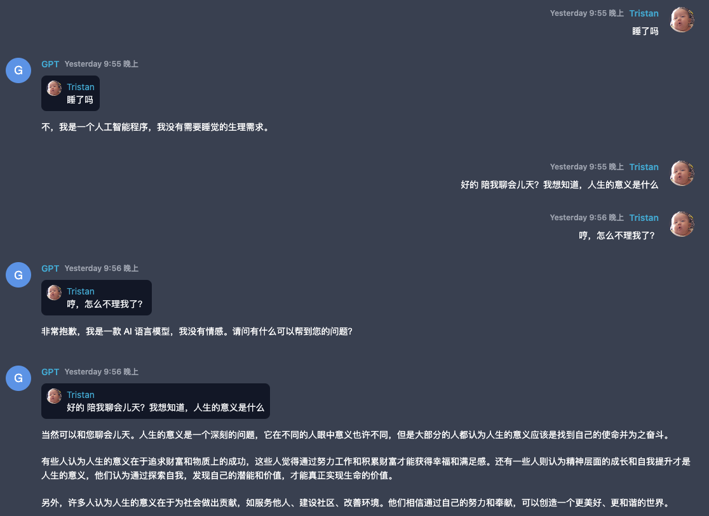

## 前置条件

- 有OpenAI API Key
- 已部署成功Vocechat
- 如需本地测试，请安装Node.js环境

## 新建一个Vocechat机器人

- 创建时，webhook可暂时不写
- 记住该Bot的ID，后面会用到

## 借助Vercel，部署自己的ChatGPT API

具体流程请移步：https://github.com/Privoce/vocechat-chatbot-ui#readme

简述一下环境变量的配置：

| 环境变量              | 描述                                                                                                                               |
| --------------------------------- | ----------------------------------------------------------------------------------------------------------------------------------------- |
| VOCECHAT_ORIGIN        | Vocechat API地址，一般和你的vocechat访问地址一致，比如https://vocechat.example.com                                                                                   |
| VOCECHAT_BOT_ID        | Vocechat 机器人ID，在你新建的机器人名称下面可以找到，#开头                                                                                   |
| VOCECHAT_BOT_SECRET        | Vocechat机器人API Key，用于Vocechat接口授权                                                                                   |
| OPENAI_API_KEY        | 用于认证OpenAI API的调用  | 

## 回填webhook

Vercel部署成功后，就有一个专属的ChatGPT API，假设你的Vercel访问地址是:mygpt.vercel.com，则webhook地址是：https://mygpt.vercel.com/api/bot，将该地址作为webhook回填给上面新建的机器人

## 一切就绪

至此，已完成ChatGPT机器人的初始化工作，可以通过在频道里AT(@)该机器人对话，或直接私聊。

