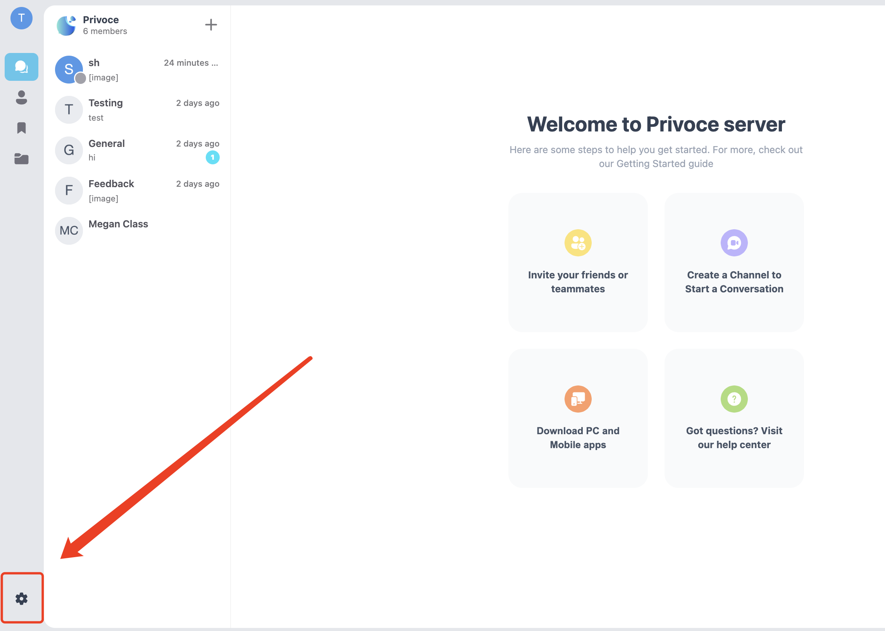

# 通过 iframe 内嵌 vocechat

## 开启访客模式

**访客模式**允许访客在未登录下，访问公共频道信息，在内嵌 vocechat 到 iframe 前，建议开启（默认关闭）。开启方式（`privoce.voce.chat`举例）：

使用管理账号进入 vocechat，然后通过页面左下角进入设置页：



选中 Overview 一栏，在右侧出现的设置项最下边即为**访客模式**控制开关：


## 内嵌 iframe

如果您想把已自部署好的 vocechat 引入到其它网站，使用 iframe 是目前最方便快捷的方式，代码仅需要一个 iframe 标签，src 设置为自部署的 vocechat 首页地址，比如`privoce.voce.chat` 的 iframe 内嵌代码：

```html
<iframe
  src="//privoce.voce.chat"
  width="800px"
  height="800px"
  frameborder="0"
></iframe>
<!-- width 和 height 可根据实际情况调整，建议使用CSS控制 -->
```
