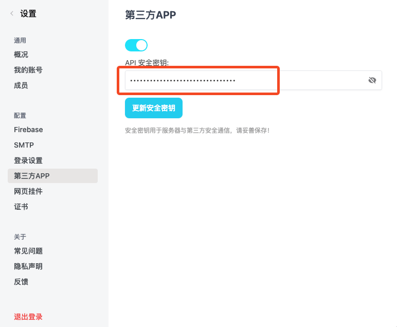

假设您有自己的账号体系，想利用已有账号自动登录 VoceChat，借助 VoceChat 提供的 API，可以很方便地接入进来。

:::tip
需自己写一个对接 VoceChat 的 API，有一定的编程工作
:::

## 接入步骤

以 `https://vocechat.yourdomain.com/` 为例，请自行替换域名，另，登录账号需为**管理角色**。

### 获取 API 密钥

访问页面：`https://vocechat.yourdomain.com/#/setting?nav=api`

### 调用 VoceChat API

拿到密钥后，在自己的代码库里调用 VoceChat 后端 API，生成用户登录的 token

:::tip 注意
后端 API 文档 `https://vocechat.yourdomain.com/api/swagger`，用到的接口是：`/token/create_third_party_key`。通过 `header` 传过去 密钥，`body` 里填自家产品的用户 ID(`userid`) 和用户名(`username`)，返回的 token 时效 2 分钟，可重复调用，建议每次跳转前即时调用。
:::

### 完成自动登录

拿到 token 后，将其作为 path 附到地址 `https://vocechat.yourdomain.com/#/oauth/[token]`，该 URL 即为自动登录 VoceChat 地址，访问该地址即可使用自家产品的账号信息自动登录 VoceChat。
