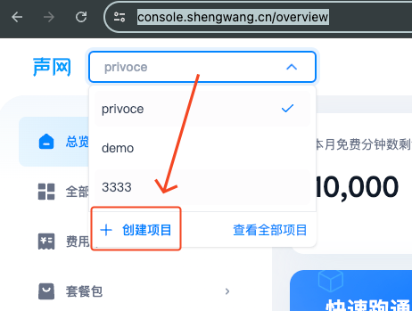
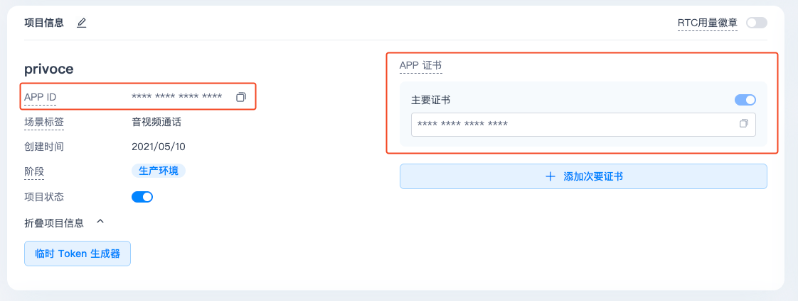
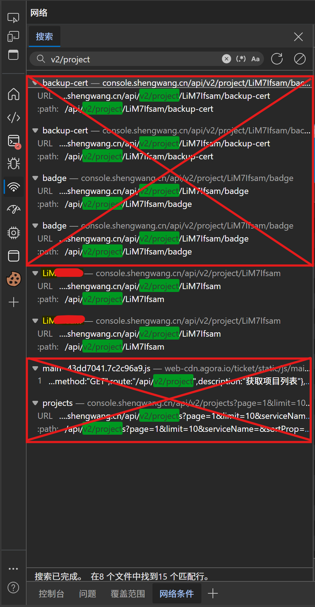
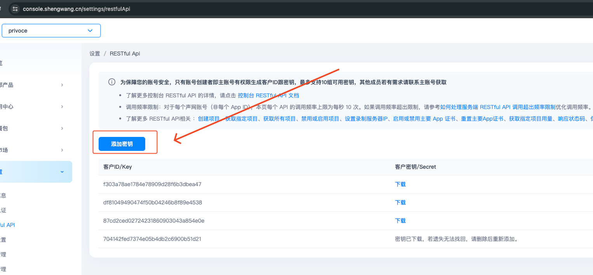
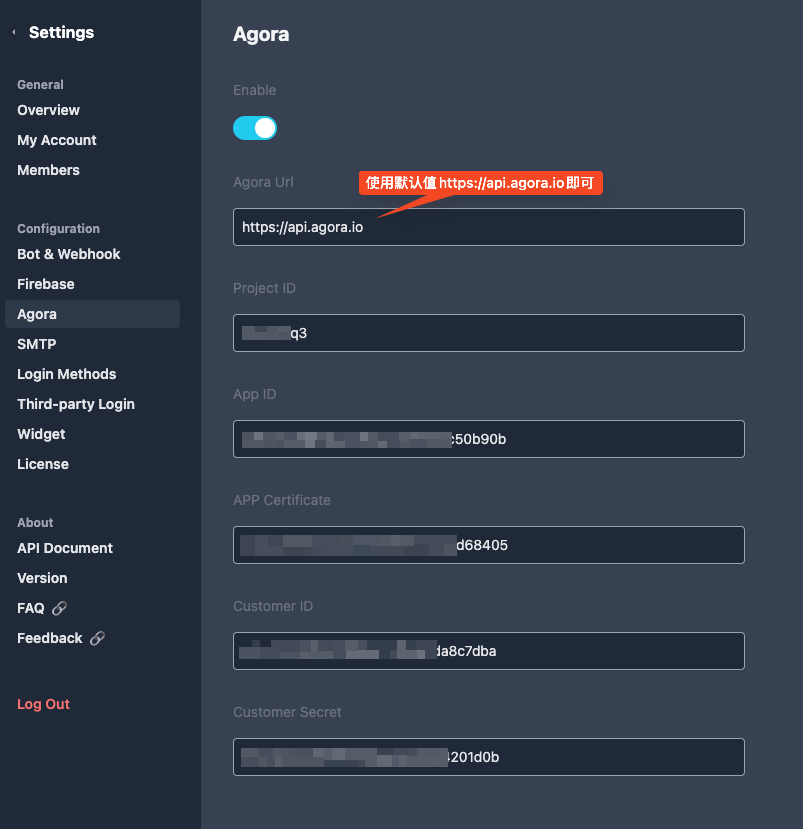
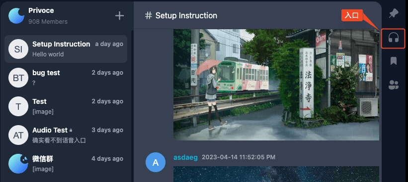

VoceChat 音视频通话功能是基于 Agora 开发，所以只需配置下 Agora，即可实现音视频通话。

:::warning 重要提示
Agora 在中国区有对应的“国产版本”，产品名：声网，地址：https://shengwang.cn
。配置项和“海外版”几乎无差别，只不过域名和使用界面不同，请注意区分。下面介绍的是国内版本的配置流程，如需国外版本，请移步此篇文章的英文版本。
:::

## 准备工作：

- 开启 https（本地调试可以忽略 https，一旦可公开访问，出于安全考虑，音视频的授权需要基于 https）
- 声网（https://shengwang.cn）注册账号
- 完成 声网 实名认证（否则功能受限）
- 创建一个语音通话的项目（https://console.shengwang.cn/overview）

## 第一步：在声网后台获取项目的配置信息

进入项目设置页面，找到我们需要的配置信息：

:::warning 重要提示
Project ID 的获取比较特殊，需先打开页面，打开DevTools中的“网络（部分可能显示为Network）”面板，刷新网页，查看 DevTools 里的 API 请求，按Ctrl+F输入“v2/project”找到一串标题为此处标黄的9位的随机字符。
为保护隐私，后6位此处使用红色涂掉了。

:::

在 https://console.shengwang.cn/settings/restfulApi 页面，生成秘钥对（客户 ID & 客户密钥）：

## 第二步：在 VoceChat 配置 Agora（声网）

进入 VoceChat 设置页面，在左侧导航找到 Agora 配置：

将第一步收集到的信息，填入对应的配置项中，刷新页面，即完成了音视频通话的初始化。

## 音视频通话的使用入口

入口在每个 channel 消息流最右侧的耳机小图标

## 注意

- 声网 有免费音视频使用额度（以分钟计算），超出部分会产生一定费用，具体值请以官方为准
- 除了音视频通话，VoceChat 还支持屏幕分享功能
- 一对一私聊音视频通话还在开发中，暂不支持，如有需求，可以新建只有两个人的私有 Channel 来替代
