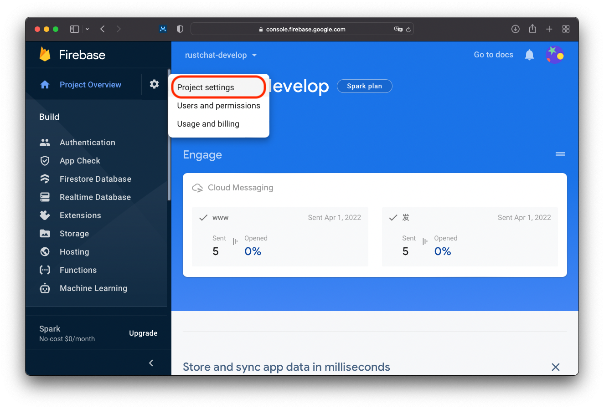
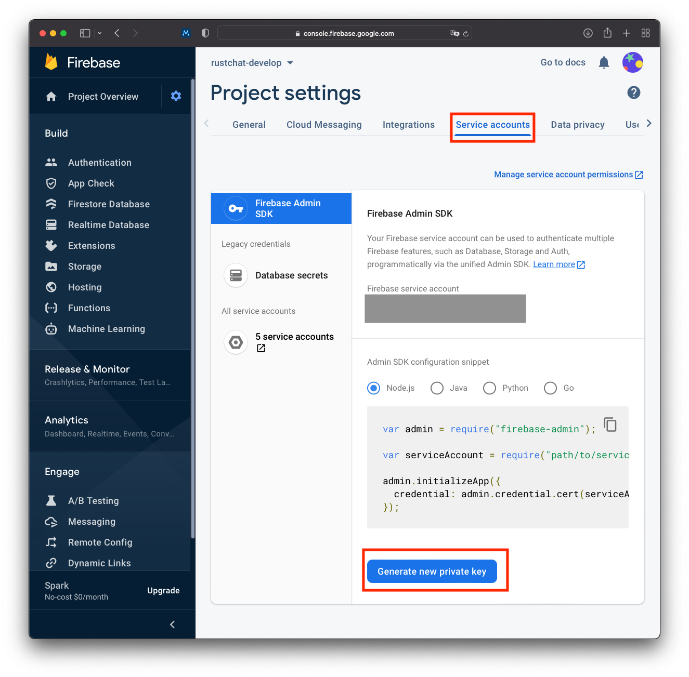

# 如何在 vocechat 中配置推送（Push Notification) 服务?

大致分为两步：首先管理员需从 Firebase 中获取配置文件，其后在 vocechat 的推送设置中更新相应的配置信息。

管理员需要首先创建 Firebase 项目，并已经将相应服务代码添加至项目中。如果已经完成上述步骤，则可跳过此段；如果没有，请参阅 [FCM](https://firebase.google.com/docs/cloud-messaging)。

## 1. 从 Firebase 控制台获取配置文件

访问 [Firebase Console](https://console.firebase.google.com)。点击左侧边栏偏上的齿轮图标进入 **Project Settings**

随后在页面上方的横向选项卡中，选择 **Service accounts**。下拉页面至最下，点击**Generate new private key**，并将下载的 json 文件保存妥当。

## 2. 将有关配置项复制至 vocechat 设置

进入 **vocechat Settings** 页面，在 **Configuration** 中选择 **Firebase**。

此页面可以填写四个配置项，分别为 Token Url, Project Id, Private Key 和 Client Email。 您可以在上述第一步下载的 .json 文件中找到相应的字段，复制并粘贴后，保存即可。

