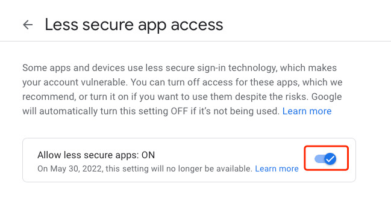

# 如何设置 SMTP ?

在启动 vocechat-server 后，访问 http://localhost:3000/，管理员账号登录，点击左下角图标"设置"，进入 SMTP 设置页面，如下：

## Gmail SMTP 开启方法。

1. 登录 https://gmail.com/ 。
2. 启用"安全性较低的应用的访问权限"
   > Less Secure Apps (Admin Side): [https://admin.google.com/ac/security/lsa](https://admin.google.com/ac/security/lsa)  
   > Less Secure Apps (Inbox Side): [https://myaccount.google.com/lesssecureapps?pli=1](https://myaccount.google.com/lesssecureapps?pli=1)
3. 
