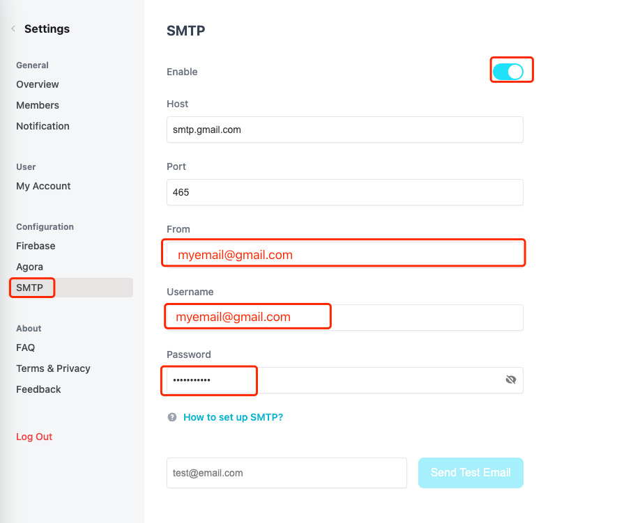

# 如何设置 SMTP ?

在启动 vocechat-server 后，访问 http://localhost:3000/，管理员账号登录，点击左下角图标"设置"，进入 SMTP 设置页面，如下：

## Gmail SMTP 开启方法。

登录 https://gmail.com/ 

右上角设置，查看所有设置：

启用IMAP：

访问这个地址：https://myaccount.google.com/apppasswords

生成一个app：

记住这个密码：

回到VoceChat SMTP，输入密码，port是465：

完成！

