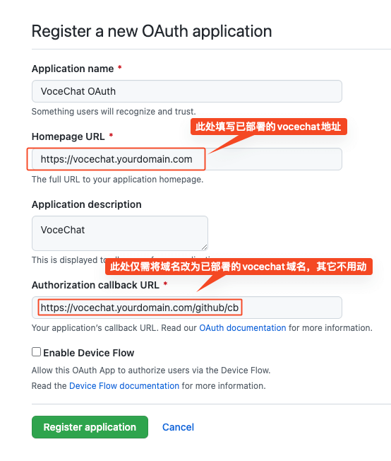
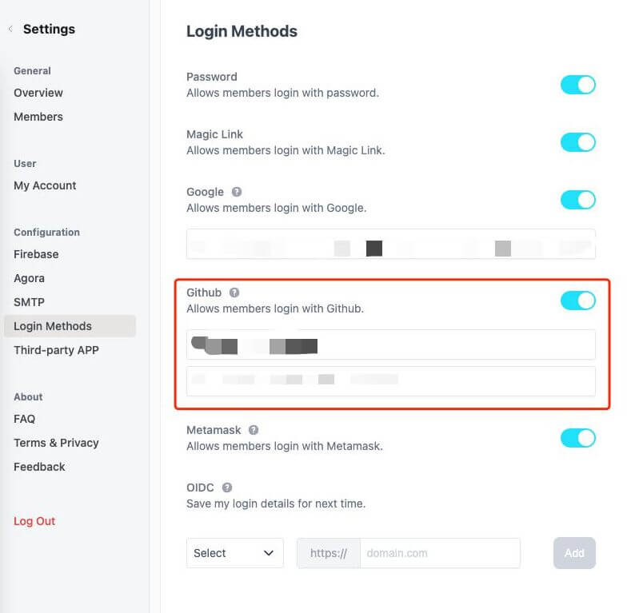

# 如何设置 Github 登录?

:::tip 设置前提
需要有 GitHub 账号
:::

## 登录 [Github](https://github.com)

## 创建 GitHub OAuth 应用

访问：[https://github.com/settings/applications/new](https://github.com/settings/applications/new)

## 获得 ClientID, ClientSecret:

## 将 ClientID, ClientSecret 填入 vocechat 后台：

