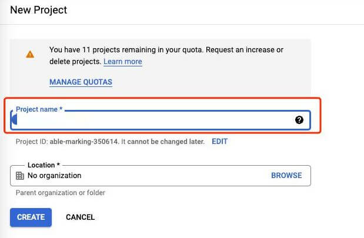
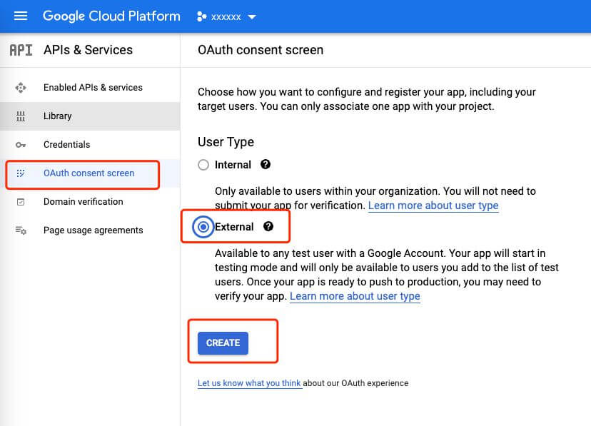
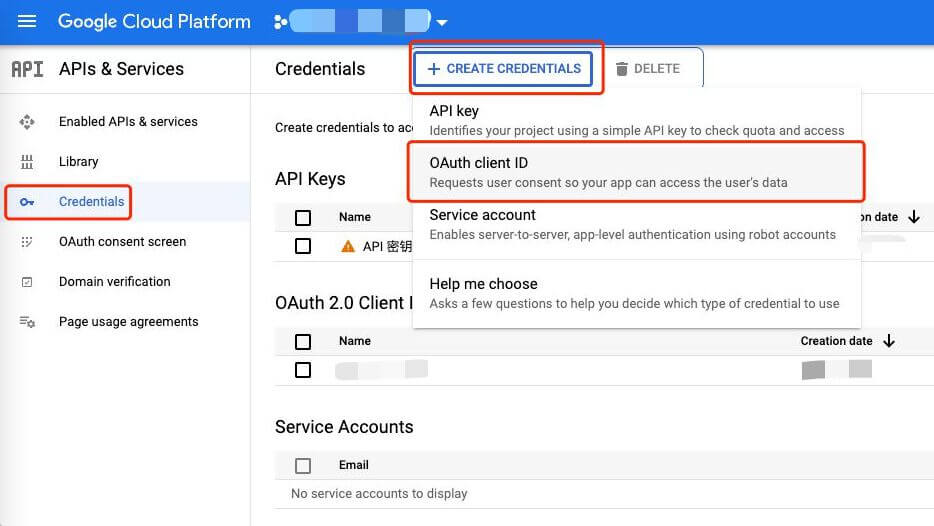
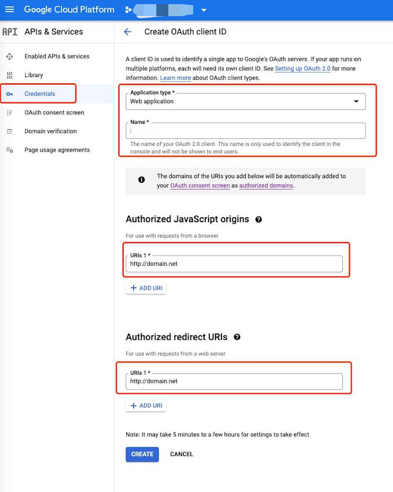
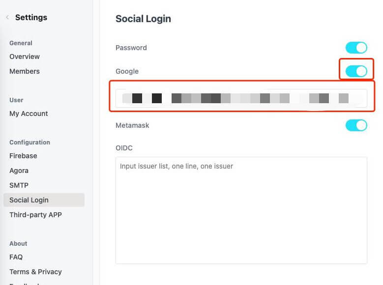

# 如何设置 Google 登录?

Google 登录启用后效果如下：  

启用步骤如下:

### 1. 您需要准备一个顶级域名

谷歌登录强制要求顶级域名，不能使用二级域名。

### 2. 打开谷歌控制台，创建新项目

https://console.developers.google.com/apis  

### 3. 创建`同意屏幕`

  

### 4. 创建`凭据`

  
  
创建完成以后，会得到 ClientID 和私钥。

### 5. 进入 vocechat 后台设置

将 ClientID 填入后台即可。  

