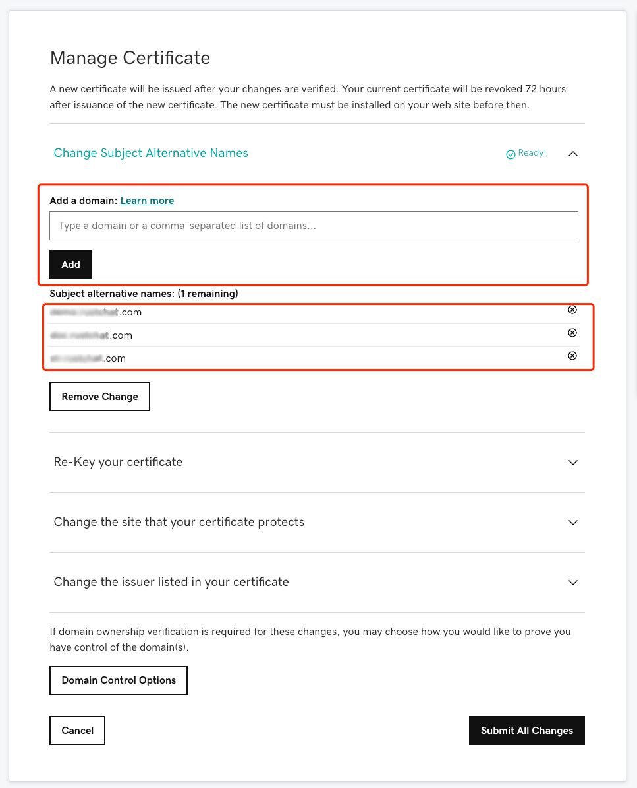

# How to get certificates in GoDaddy?

### GoDaddy 购买并配置 SSL 证书常在英文环境中进行，暂未进行中文翻译。

Prepositional knowledges:

- .key: PKCS8 格式的私钥文件 (Base64 编码)
- .csr:  PKCS10 格式证书中的部分信息(包含了公钥、组织名等，公钥由私钥文件 xxx.key 生成)
- .crt: 证书文件，它添加了 CA 签名信息，基于 .csr 文件。Godaddy 在用户上传完 .csr 文件后，会生成 .crt 文件。
- .der: 二进制格式的证书文件，它可以从 .pem 格式转化过来。命令 `openssl x509 -inform der -in xxx.der -out xxx.pem`
- .pem: base64 格式的文件, 它的具体内容由它内部的头部信息指定，可以是私钥，公钥，证书或者其他。
- .p12, .pkcs12, .pfx: PKCS12 格式, 它里面合并包含了私钥，公钥，证书等信息。

### 1. 在本机生成私钥 & CSR & 证书:

```shell
# generate private key
openssl genpkey -algorithm RSA \
    -pkeyopt rsa_keygen_bits:4096 \
    -pkeyopt rsa_keygen_pubexp:65537 | \
    openssl pkcs8 -topk8 -nocrypt -outform pem > voce.chat.key

# generate CSR file
openssl req -subj "/C=US/ST=Arizona/L=Scottsdale/O=Privoce,Inc./CN=*.voce.chat/emailAddress=api.privoce@gmail.com" \
    -new -days 3650 -key voce.chat.key -out voce.chat.csr

# generate self-sign file
openssl x509 -signkey voce.chat.key -in voce.chat.csr -req -days 365 -out voce.chat.crt

# view certificate
openssl req -text -noout -verify -in voce.chat.csr
```
我们将得到下面的文件，非常重要，请备份好它们：

```shell
-rw-r--r--  1 user  staff   1.9K May  5 00:34 voce.chat.crt
-rw-r--r--  1 user  staff   1.7K May  5 00:34 voce.chat.csr
-rw-r--r--  1 user  staff   3.2K May  5 00:29 voce.chat.key
```

采用 .key .csr 我们已经可以配置 nginx 类似的系统，只有浏览器会提示风险。

### 2. 要申请 GoDaddy 帐户并购买域名证书，您需要完成付款流程并按照提示进行操作。

Godaddy website: [https://www.godaddy.com/](https://www.godaddy.com/)

### 3. 设置域名 & CSR:




### 4. 下载证书

  
您将获得一个压缩文件 xxx.zip，解压后，将获得以下文件：

```bash
-rw-rw-r--@ 1 user  staff   2.4K May  4 07:47 1aeb156731cb52d3.crt
-rw-rw-r--@ 1 user  staff   2.4K May  4 07:47 1aeb156731cb52d3.pem
-rw-rw-r--@ 1 user  staff   4.7K May  4 07:47 gd_bundle-g2-g1.crt
```

### 5.合并证书并，覆盖掉原来的自签名证书（如果有）。

```shell
cat 1aeb156731cb52d3.crt gd_bundle-g2-g1.crt > voce.chat.crt
```

### 6. vocechat-server 配置

拷贝证证书文件:

```shell
cp voce.chat.crt cert/ca.crt
cp voce.chat.key cert/ca.key
```

修改 config/config.toml

```shell

[network]
bind = "0.0.0.0:3000"
domain = "domain.com"

# [network.tls]
# type = "self_signed"

[network.tls]
type = "certificate"
# cert = "/path/voce.chat.crt"
# key = "...."
path = "./cert"
```

重启 vocechat-server:

```shell
/etc/init.d/vocechat-server restart
```

<!--
```shell
server {
    listen 443;
    server_name www.xxx.com;
    ssl	on;
    ssl_certificate /usr/local/ssl/domain.crt;
    ssl_certificate_key /usr/local/ssl/domain.key;
}
```
-->
