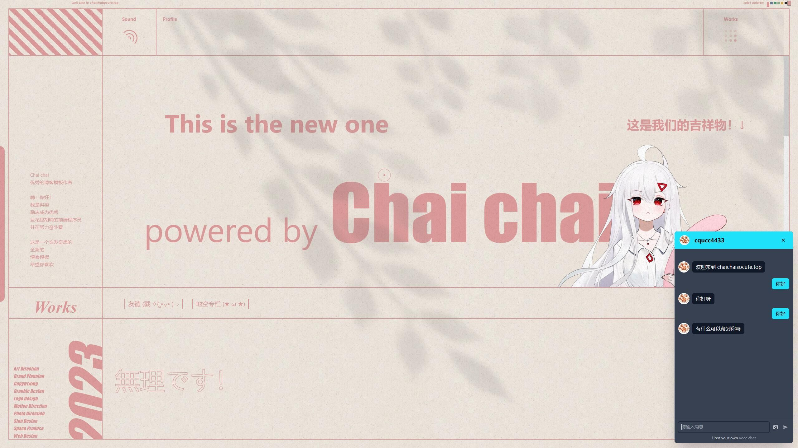

## 前置条件

使用挂件之前，请确保具备以下条件：

- 完成 vocechat 的部署（部署流程请参考：[安装部署 VoceChat](/install)）
- 域名支持 https (如果挂载的宿主网页没有使用 https，可以使用 http)
- 完成 vocechat 的初始化流程
- 允许公共注册（Setting --> Overview）
  

## 使用 widget

以部署实例域名为`https://vocechat.yourdomain.com`为例：

```html
<!-- 将以下代码片段放于你的网页内，建议放于 body 底部 -->
<script
  data-host-id="1"
  data-auto-reg="true"
  data-login-token=""
  data-close-width="52"
  data-close-height="52"
  data-open-width="380"
  data-open-height="680"
  data-position="right"
  data-welcome="自定义欢迎语"
  data-theme-color="#1fe1f9"
  data-logo="https://yourimage.link/icon.jpg"
  src="https://vocechat.yourdomain.com/widget.js"
  async
></script>
```

配置项说明：

<table>
<thead >
  <tr><th scope="col">配置键</th><th scope="col"  >默认值</th><th scope="col"  >备注</th></tr>
</thead>
<tbody>
  <tr ><td >id</td><td >""</td><td >指定挂件 ID</td></tr>
  <tr ><td >host-id</td><td >1</td><td >指定访客和谁聊天</td></tr>
  <tr ><td >auto-reg</td><td >true</td><td >true: 访客自动注册，无需任何输入项，false: 需要输入邮箱地址</td></tr>
  <tr ><td >login-token</td><td >""（空字符串）</td><td >用自有平台账号系统自动登录 Voce 的 token。如非对接自有平台请不要填写，对接方式详见:<a href="/login-with-other-account">第三方登录</a></td></tr>
  <tr ><td >title</td><td >弹窗标题</td><td >聊天弹窗顶部自定义标题</td></tr>
  <tr ><td >logo</td><td >logo 图片 URL</td><td >聊天弹窗顶部自定义 logo 图标地址</td></tr>
  <tr ><td >theme-color</td><td >#1fe1f9</td><td >挂件主题色</td></tr>
  <tr ><td >close-width</td><td >52(px)</td><td >挂件关闭态的宽度</td></tr>
  <tr ><td >close-height</td><td >52(px)</td><td >挂件关闭态的高度</td></tr>
  <tr ><td >open-width</td><td >380(px)</td><td >挂件打开态的宽度</td></tr>
  <tr ><td >open-height</td><td >680(px)</td><td >挂件打开态的高度</td></tr>
  <tr ><td >position</td><td >right</td><td >挂件的位置，居左 (left) 或居右 (right)</td></tr>
  <tr ><td >welcome</td><td >你好，很高兴认识你</td><td >自定义欢迎语，可包含 html 代码片段，比如加个超链接代码：&lt;a href="mailto:co
tact@example.com"&gt;联系我&lt;/a&gt;，或者图片&lt;img src="xxx"/&gt;</td></tr>
</tbody>
<tfoot >
  <tr><td colSpan="3">* 所有的配置项目都是可选的，并以<i >data-</i>开头</td></tr>
</tfoot>
</table>

如果你想更精确控制挂件的样式，可以借助 widget 元素的 ID，自行写 CSS 样式，加到自己的 html 或者 css 文件中，如下示例：

```html
<style>
  #VOCECHAT_WIDGET {
    left:10px  /* left position */
    bottom: 5px /* bottom position */
  }
</style>
```

## WordPress 中使用 VoceChat Widget

### 方法一：通过主题文件集成（推荐）

这是最稳定的集成方式，适合有一定技术基础的用户。

#### 1. 编辑主题文件

1. 登录 WordPress 后台
2. 进入 **外观 > 主题编辑器**
3. 选择当前激活的主题
4. 找到并编辑 `footer.php` 文件

#### 2. 添加 Widget 代码

在 `footer.php` 文件的 `</body>` 标签前添加以下代码：

```php
<?php if (!is_admin()) : ?>
<script
  data-host-id="1"
  data-auto-reg="true"
  data-login-token=""
  data-close-width="52"
  data-close-height="52"
  data-open-width="380"
  data-open-height="680"
  data-position="right"
  data-welcome="欢迎咨询，我们将尽快回复您！"
  data-theme-color="#1fe1f9"
  data-logo="<?php echo get_site_icon_url(); ?>"
  src="https://vocechat.yourdomain.com/widget.js"
  async
></script>
<?php endif; ?>
```

**注意事项：**

- 将 `https://vocechat.yourdomain.com` 替换为您的 VoceChat 实例域名
- `<?php if (!is_admin()) : ?>` 确保挂件只在前端显示，不在后台显示
- `<?php echo get_site_icon_url(); ?>` 自动使用网站的 favicon 作为挂件图标

### 方法二：使用插件集成

#### 1. Insert Headers and Footers 插件

1. 安装并启用 "Insert Headers and Footers" 插件
2. 进入 **设置 > Insert Headers and Footers**
3. 在 "Scripts in Footer" 部分添加 Widget 代码：

```html
<script>
  // 确保只在前端页面加载
  if (!document.body.classList.contains("wp-admin")) {
    var script = document.createElement("script");
    script.setAttribute("data-host-id", "1");
    script.setAttribute("data-auto-reg", "true");
    script.setAttribute("data-login-token", "");
    script.setAttribute("data-close-width", "52");
    script.setAttribute("data-close-height", "52");
    script.setAttribute("data-open-width", "380");
    script.setAttribute("data-open-height", "680");
    script.setAttribute("data-position", "right");
    script.setAttribute("data-welcome", "欢迎咨询，我们将尽快回复您！");
    script.setAttribute("data-theme-color", "#1fe1f9");
    script.src = "https://vocechat.yourdomain.com/widget.js";
    script.async = true;
    document.body.appendChild(script);
  }
</script>
```

#### 2. Code Snippets 插件

1. 安装并启用 "Code Snippets" 插件
2. 进入 **Snippets > Add New**
3. 创建新的代码片段：

```php
/**
 * 添加 VoceChat Widget
 */
function add_vocechat_widget() {
    // 只在前端显示
    if (is_admin()) return;

    ?>
    <script
      data-host-id="1"
      data-auto-reg="true"
      data-login-token=""
      data-close-width="52"
      data-close-height="52"
      data-open-width="380"
      data-open-height="680"
      data-position="right"
      data-welcome="欢迎咨询，我们将尽快回复您！"
      data-theme-color="#1fe1f9"
      data-logo="<?php echo get_site_icon_url(); ?>"
      src="https://vocechat.yourdomain.com/widget.js"
      async
    ></script>
    <?php
}
add_action('wp_footer', 'add_vocechat_widget');
```

### 方法三：通过 functions.php 添加

如果您熟悉 WordPress 开发，可以直接在主题的 `functions.php` 文件中添加：

```php
// 添加 VoceChat Widget
function add_vocechat_widget() {
    // 只在前端显示，排除管理员页面
    if (is_admin()) return;

    ?>
    <script
      data-host-id="1"
      data-auto-reg="true"
      data-login-token=""
      data-close-width="52"
      data-close-height="52"
      data-open-width="380"
      data-open-height="680"
      data-position="right"
      data-welcome="有什么可以帮助您的吗？"
      data-theme-color="#1fe1f9"
      data-logo="<?php echo get_site_icon_url(); ?>"
      src="https://vocechat.yourdomain.com/widget.js"
      async
    ></script>
    <?php
}
add_action('wp_footer', 'add_vocechat_widget');
```

### WordPress 特定配置建议

#### 1. 响应式设计优化

针对 WordPress 主题的响应式特性，建议添加以下 CSS：

```css
/* 移动端优化 */
@media (max-width: 768px) {
  #VOCECHAT_WIDGET {
    right: 10px !important;
    bottom: 60px !important; /* 避免与移动端菜单冲突 */
  }
}

/* 避免与固定元素冲突 */
#VOCECHAT_WIDGET {
  z-index: 9999 !important;
}
```

#### 2. 性能优化

为了提高页面加载速度，可以延迟加载 Widget：

```javascript
// 页面加载完成后再加载 Widget
window.addEventListener("load", function () {
  setTimeout(function () {
    var script = document.createElement("script");
    script.setAttribute("data-host-id", "1");
    script.setAttribute("data-auto-reg", "true");
    script.setAttribute("data-welcome", "欢迎咨询！");
    script.src = "https://vocechat.yourdomain.com/widget.js";
    script.async = true;
    document.body.appendChild(script);
  }, 2000); // 延迟 2 秒加载
});
```

#### 3. 条件显示

可以设置 Widget 只在特定页面显示：

```php
function add_vocechat_widget() {
    // 只在前端显示
    if (is_admin()) return;
    // 只在首页和联系页面显示
    if (!is_home() && !is_page('contact')) return;
    // Widget 代码...
}
```

### 常见问题解决

#### 1. Widget 不显示

- 检查 VoceChat 域名是否正确
- 确认 VoceChat 服务是否正常运行
- 检查浏览器控制台是否有错误信息

#### 2. 样式冲突

- 使用浏览器开发者工具检查 CSS 冲突
- 添加 `!important` 优先级
- 调整 `z-index` 层级

#### 3. 移动端显示问题

- 测试不同屏幕尺寸
- 添加响应式 CSS
- 调整 Widget 位置参数

### 最佳实践

1. **备份网站**：修改主题文件前务必备份
2. **使用子主题**：避免主题更新时丢失自定义代码
3. **测试兼容性**：在不同设备和浏览器上测试
4. **监控性能**：确保 Widget 不影响页面加载速度
5. **用户体验**：合理设置欢迎语和样式，提升用户体验

## 分享链接，直接对话

Widget 支持嵌入的同时，也支持直接链接访问，还是以部署实例域名为`https://vocechat.yourdomain.com`为例，该 Widget 直接访问的地址为：
`https://vocechat.yourdomain.com/widget.html?host=1`。

## 线上实例

### 柴柴的个人博客

- vocechat: https://chat.cqucc4433.top/
- vocechat widget: https://chaichaisocute.top/
  

### 杨二的个人站点

- vocechat: https://vocechat.yangerxiao.com/
- vocechat widget: https://yangerxiao.com/
  

### 石磊的个人站点

- vocechat: https://vc.moduoyu.com/
- vocechat widget: https://laoona.com/
  

### Tom 的个人小站

- vocechat: https://vocechat.tomzhu.site/
- vocechat widget: https://tomzhu.site/
  

:::tip 👏🏻👏🏻👏🏻
欢迎联系我们贡献线上实例
:::
