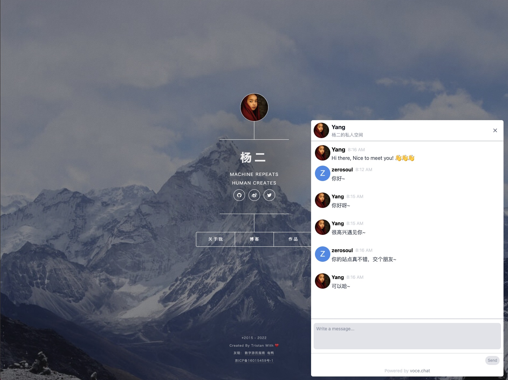

## 前置条件

使用挂件之前，请确保具备以下条件：

- 已完成 vocechat 的部署（部署流程请参考：[Docker 安装 [推荐]](/install-by-docker)）
- 已完成 vocechat 的初始化流程
- 允许公共注册
- 开启并配置好至少一个第三方登录

## 使用 widget

以部署实例域名为`https://vocechat.yourdomain.com`为例:

```html
<!-- 将以下代码片段放于你的网页内，建议放于body底部 -->
<script
  data-host-id="4"
  data-origin="https://vocechat.yourdomain.com"
  data-close-width="52"
  data-close-height="52"
  data-open-width="600"
  data-open-height="800"
  src="https://vocechat.yourdomain.com/widget.js"
  async
/>
```

配置项说明:

<table >
<thead >
  <tr><th scope="col">配置键</th><th scope="col"  >默认值</th><th scope="col"  >备注</th></tr>
</thead>
<tbody>
  <tr ><td >host-id</td><td >1</td><td >指定访客和谁聊天</td></tr>
  <tr ><td >origin</td><td >location.origin</td><td >指明脚本的来源</td></tr>
  <tr ><td >close-width</td><td >52(px)</td><td >挂件关闭态的宽度</td></tr>
  <tr ><td >close-height</td><td >52(px)</td><td >挂件关闭态的高度</td></tr>
  <tr ><td >open-width</td><td >600(px)</td><td >挂件打开态的宽度</td></tr>
  <tr ><td >open-height</td><td >800(px)</td><td >挂件打开态的高度</td></tr>
</tbody>
<tfoot >
  <tr><td colspan="3">* 所有的配置项目都是可选的，并以<i >data-</i>开头</td></tr>
</tfoot>
</table>

## 线上实例

### 杨二的个人站点

- vocechat：https://vocechat.yangerxiao.com/
- vocechat widget: https://yangerxiao.com/
  

> 欢迎联系我们贡献线上实例 👏🏻👏🏻👏🏻
