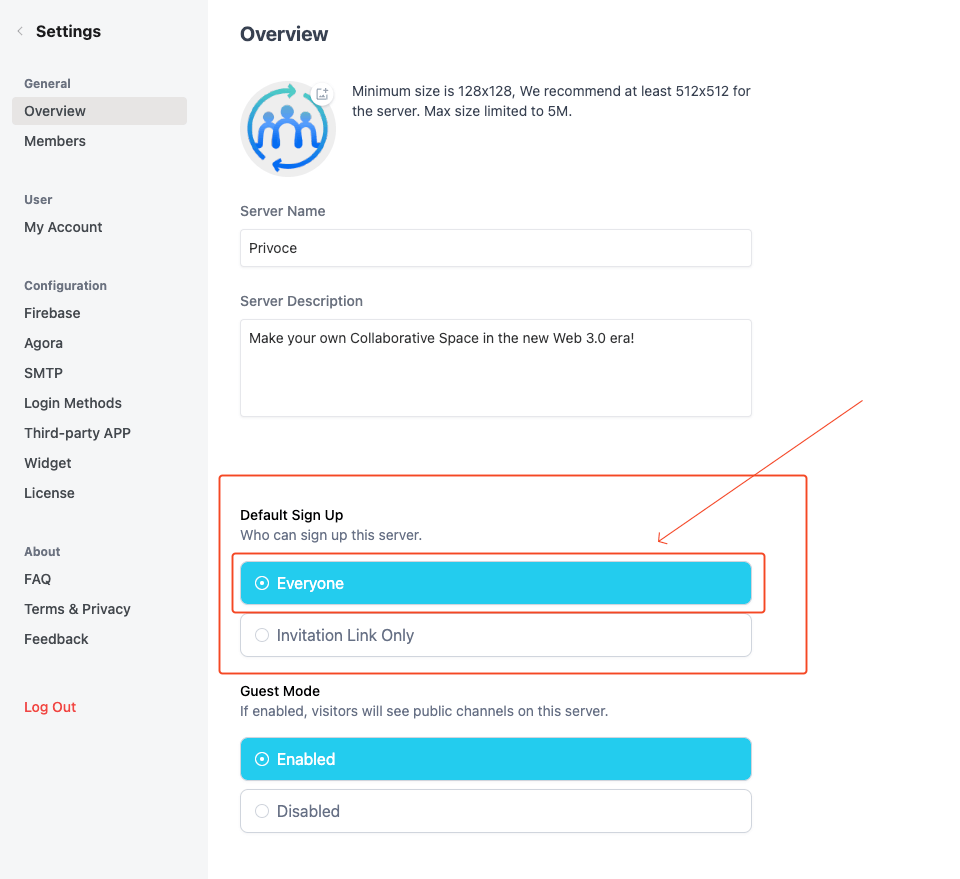
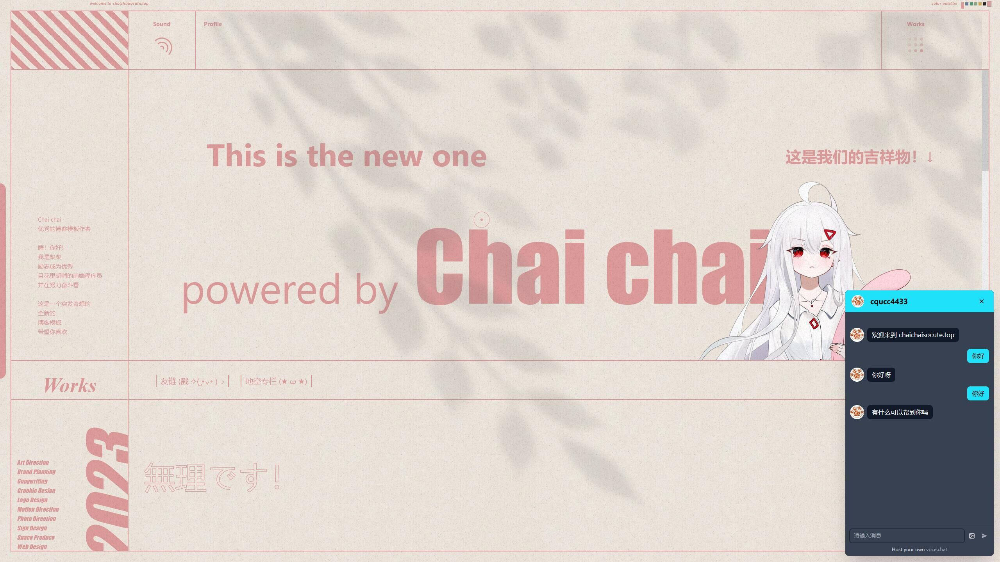
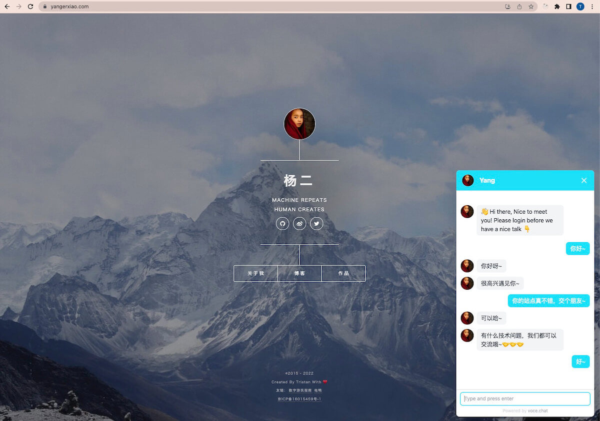
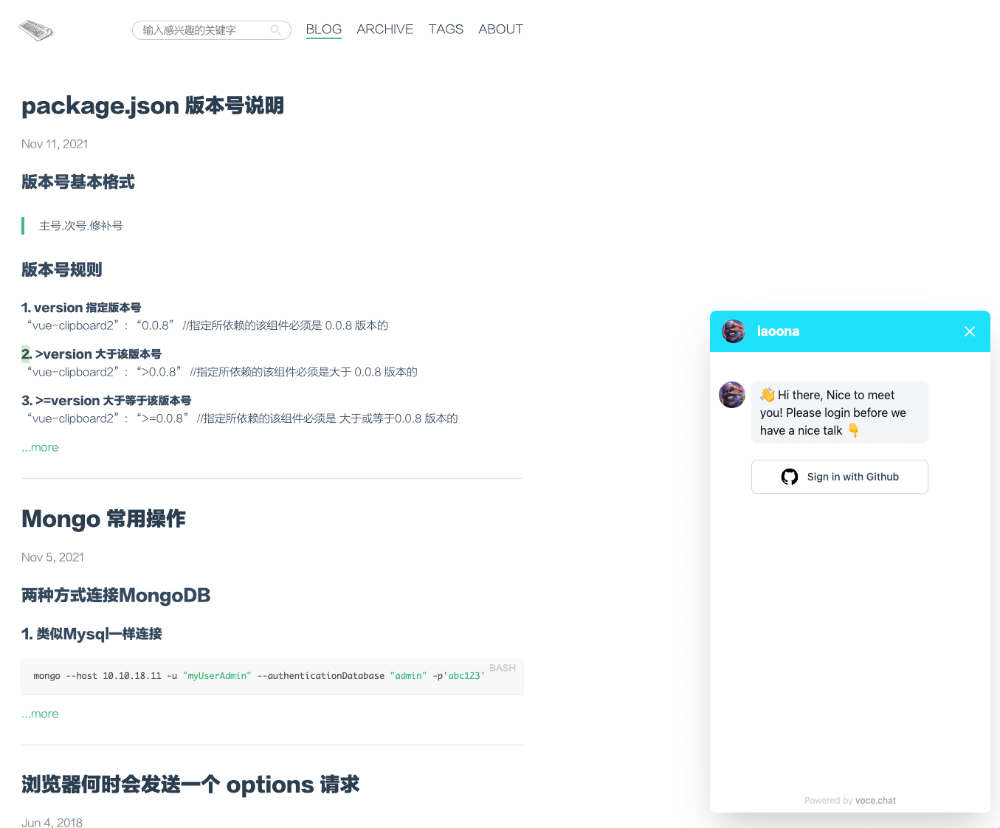
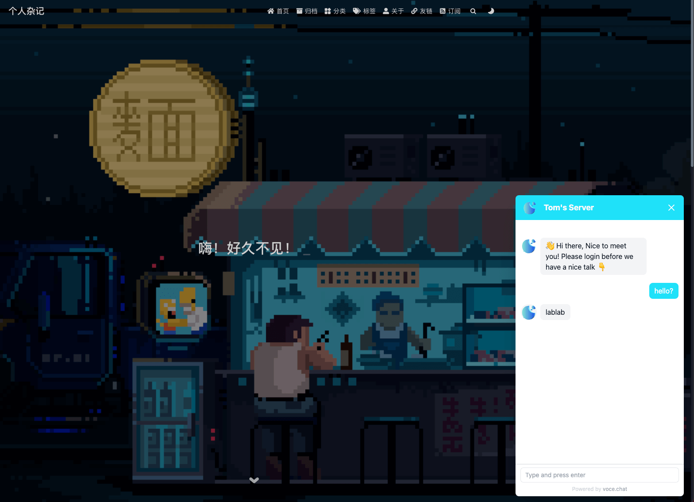

## 前置条件

使用挂件之前，请确保具备以下条件：

- 完成 vocechat 的部署（部署流程请参考：[安装部署 VoceChat](/install)）
- 域名支持 https (如果挂载的宿主网页没有使用 https，可以使用 http)
- 完成 vocechat 的初始化流程
- 允许公共注册（Setting --> Overview）
  

## 使用 widget

以部署实例域名为`https://vocechat.yourdomain.com`为例：

```html
<!-- 将以下代码片段放于你的网页内，建议放于 body 底部 -->
<script
  data-host-id="1"
  data-auto-reg="true"
  data-login-token=""
  data-close-width="52"
  data-close-height="52"
  data-open-width="380"
  data-open-height="680"
  data-position="right"
  data-welcome="自定义欢迎语"
  src="https://vocechat.yourdomain.com/widget.js"
  async
></script>
```

配置项说明：

<table>
<thead >
  <tr><th scope="col">配置键</th><th scope="col"  >默认值</th><th scope="col"  >备注</th></tr>
</thead>
<tbody>
  <tr ><td >id</td><td >""</td><td >指定挂件 ID</td></tr>
  <tr ><td >host-id</td><td >1</td><td >指定访客和谁聊天</td></tr>
  <tr ><td >auto-reg</td><td >true</td><td >true: 访客自动注册，无需任何输入项，false: 需要输入邮箱地址</td></tr>
  <tr ><td >login-token</td><td >""（空字符串）</td><td >用自有平台账号系统自动登录 Voce 的 token。如非对接自有平台请不要填写，对接方式详见:<a href="/login-with-other-account">第三方登录</a></td></tr>
  <tr ><td >theme-color</td><td >#1fe1f9</td><td >挂件主题色</td></tr>
  <tr ><td >close-width</td><td >52(px)</td><td >挂件关闭态的宽度</td></tr>
  <tr ><td >close-height</td><td >52(px)</td><td >挂件关闭态的高度</td></tr>
  <tr ><td >open-width</td><td >380(px)</td><td >挂件打开态的宽度</td></tr>
  <tr ><td >open-height</td><td >680(px)</td><td >挂件打开态的高度</td></tr>
  <tr ><td >position</td><td >right</td><td >挂件的位置，居左 (left) 或居右 (right)</td></tr>
  <tr ><td >welcome</td><td >你好，很高兴认识你</td><td >自定义欢迎语，可包含 html 代码片段，比如加个超链接代码：&lt;a href="mailto:co
tact@example.com"&gt;联系我&lt;/a&gt;</td></tr>
</tbody>
<tfoot >
  <tr><td colSpan="3">* 所有的配置项目都是可选的，并以<i >data-</i>开头</td></tr>
</tfoot>
</table>

如果你想更精确控制挂件的样式，可以借助 widget 元素的 ID，自行写 CSS 样式，加到自己的 html 或者 css 文件中，如下示例：

```html
<style>
  #VOCECHAT_WIDGET {
    left:10px  /* left position */
    bottom: 5px /* bottom position */
  }
</style>
```

## 分享链接，直接对话

Widget 支持嵌入的同时，也支持直接链接访问，还是以部署实例域名为`https://vocechat.yourdomain.com`为例，该 Widget 直接访问的地址为：
`https://vocechat.yourdomain.com/widget.html?host=1`。

## 线上实例

### 柴柴的个人博客

- vocechat: https://chat.cqucc4433.top/
- vocechat widget: https://chaichaisocute.top/
  

### 杨二的个人站点

- vocechat: https://vocechat.yangerxiao.com/
- vocechat widget: https://yangerxiao.com/
  

### 石磊的个人站点

- vocechat: https://vc.moduoyu.com/
- vocechat widget: https://laoona.com/
  

### Tom 的个人小站

- vocechat: https://vocechat.tomzhu.site/
- vocechat widget: https://tomzhu.site/
  

:::tip 👏🏻👏🏻👏🏻
欢迎联系我们贡献线上实例
:::
